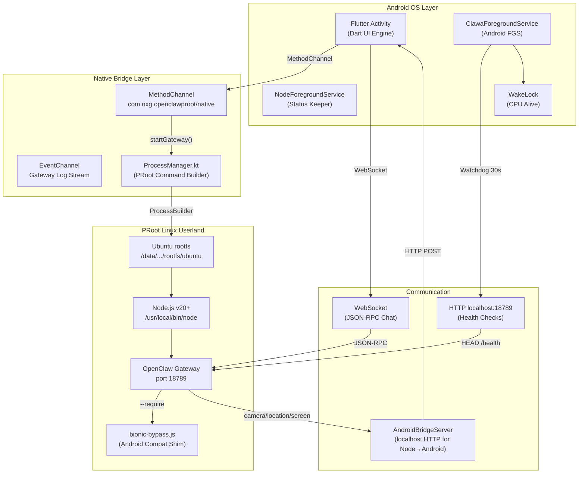
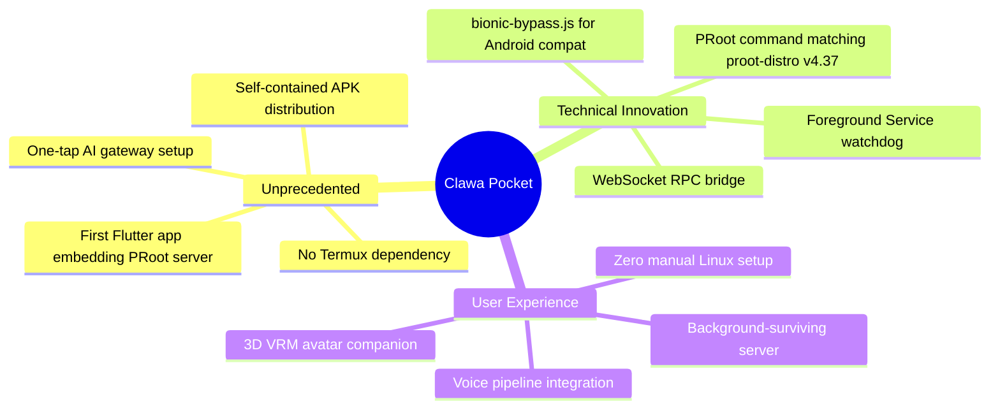
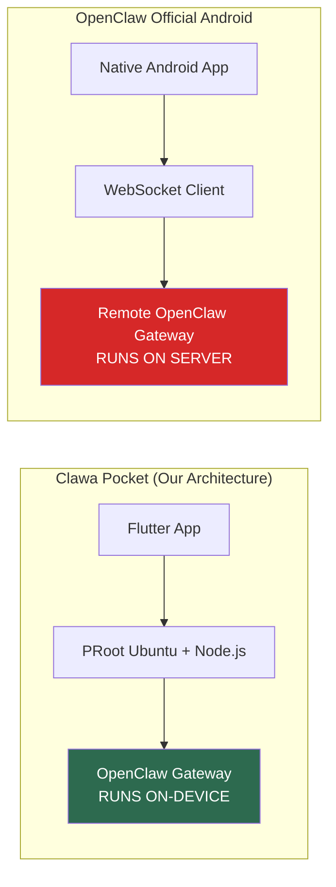
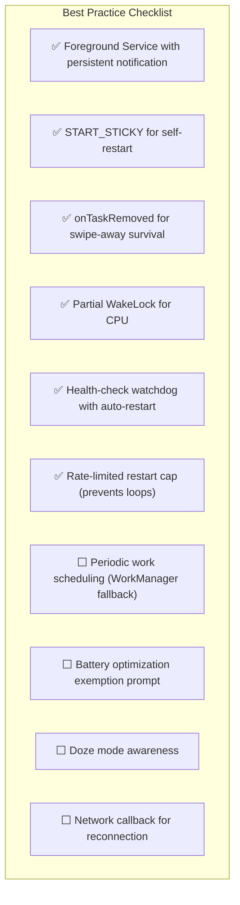
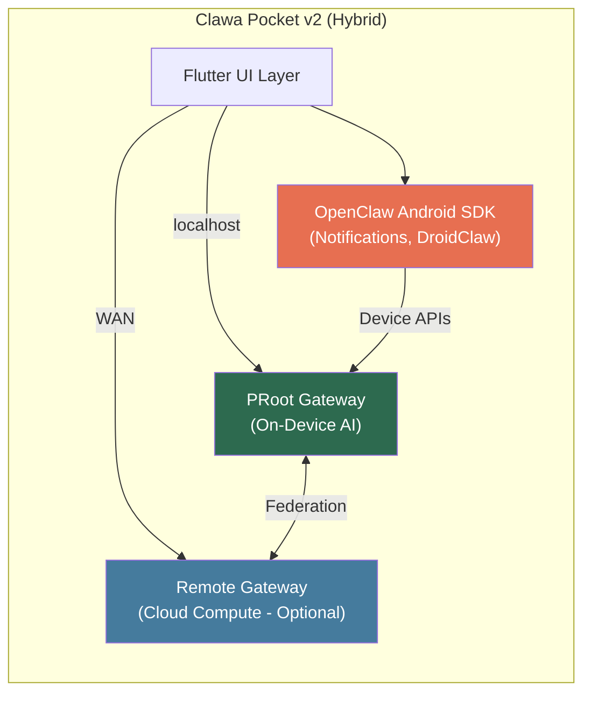

# Clawa Pocket — Architecture Deep-Dive & Competitive Landscape

> **Audit-Grade Technical Report** — March 2026
> Authors: Architecture Review Team
> Target Audience: Senior Engineers, Technical Auditors, Architecture Reviewers

---

## Executive Summary

Clawa Pocket runs a **full OpenClaw AI gateway** entirely on-device by embedding a Linux userland (Ubuntu) inside an Android app via **PRoot** — a user-space `chroot` implementation that requires **no root access**. The gateway (a Node.js server) runs inside this Linux environment, connected to the Flutter UI via localhost HTTP/WebSocket bridges and native Android MethodChannels.

This architecture is **genuinely novel**. No known production app on the Google Play Store ships a bundled Linux rootfs + PRoot + Node.js server inside a Flutter APK. The approach enables full server-side AI agent capabilities (tool use, persistent sessions, multi-model orchestration) to run offline-capable on a mobile phone.

---

## 1. Architecture Overview

### Layer Responsibilities

| Layer | Component | Role |
|---|---|---|
| **UI** | Flutter Activity + WebView | Chat interface, VRM avatar, PiP mode |
| **Android Native** | `ClawaForegroundService` | Keeps gateway alive via START_STICKY + WakeLock |
| **Android Native** | `ProcessManager.kt` | Builds PRoot commands matching `proot-distro` v4.37 |
| **Android Native** | `AndroidBridgeServer` | Exposes device APIs (camera, sensors) to Node.js |
| **Linux Userland** | Ubuntu rootfs | Full apt-based package ecosystem |
| **Runtime** | Node.js + OpenClaw | AI gateway with multi-model chat, tools, WebSocket RPC |
| **Compat** | `bionic-bypass.js` | Patches Node.js APIs that fail under Android's Bionic libc |

---

## 2. Novelty Assessment — How Unique Is This?

### Comparable Projects in the Wild

| Project | Approach | Root Required | Production App | Shipping to Users |
|---|---|---|---|---|
| **Termux** | Terminal + pkg ecosystem | ❌ No | ✅ (F-Droid) | ✅ (Dev tool) |
| **Termux + proot-distro** | Ubuntu inside Termux | ❌ No | ⚠️ (DIY) | ❌ Manual setup |
| **OPENCLAW-DROID** | Shell scripts for Termux | ❌ No | ❌ (Scripts) | ❌ Manual |
| **UserLAnd** | Linux via PRoot in app | ❌ No | ✅ (Play Store) | ✅ (Ubuntu GUI) |
| **Droidspaces** | Full Linux containers | ✅ Yes | ❌ (CLI) | ❌ Root only |
| **AnLinux** | PRoot distro installer | ❌ No | ✅ (Play Store) | ✅ (GUI setup) |
| **📱 Clawa Pocket** | **Flutter + PRoot + Node.js + OpenClaw** | **❌ No** | **✅ APK** | **✅ One-tap** |

### Key Differentiators

> [!IMPORTANT]
> **No known production application on any app store bundles a PRoot Linux environment + Node.js server + AI gateway inside a single Flutter APK.** UserLAnd and AnLinux ship Linux environments but are general-purpose tools — they don't integrate with a specific server or AI framework. Clawa Pocket is architecturally unique.

---

## 3. OpenClaw Official Android Direction

OpenClaw has been developing its own Android capabilities (late 2025 — early 2026):

### What OpenClaw's Official Android App Offers

| Capability | Status | How It Works |
|---|---|---|
| **Device as Node** | ✅ Active | Android device joins the OpenClaw network as a node |
| **Camera Access** | ✅ Active | AI agent can snap photos, record video via phone camera |
| **Screen Recording** | ✅ Active | Agent can capture screen content |
| **Location** | ✅ Active | GPS data exposed to agent tools |
| **Notifications** | 🔄 In Development | Agent can read/interact with device notifications |
| **Foreground Service** | ✅ Active | Persistent notification to stay alive |
| **DroidClaw (ADB)** | 🧪 Experimental | LLM-driven UI automation via ADB |

### Architecture Comparison

| Aspect | Clawa Pocket | OpenClaw Official Android |
|---|---|---|
| **Gateway Location** | 🟢 On-device (full sovereignty) | 🔴 Remote server required |
| **Offline Capable** | 🟢 Yes (local models possible) | 🔴 No (requires server connection) |
| **Privacy** | 🟢 All data stays on phone | 🟡 Data flows to remote server |
| **Device APIs** | 🟢 Camera, sensors, haptics, screen | 🟢 Camera, notifications, screen |
| **Setup Complexity** | 🟢 One-tap (bundled rootfs) | 🟡 Requires separate server |
| **Compute Power** | 🟡 Limited by phone hardware | 🟢 Server-class hardware |
| **Maintenance** | 🟡 Must update rootfs + Node in-app | 🟢 Server updates independently |

> [!NOTE]
> **These architectures are complementary, not competing.** The official OpenClaw Android app is a *node* (thin client), while Clawa Pocket is a *self-hosted gateway* (thick client). A future hybrid could use Clawa's on-device gateway while also connecting to remote gateways for heavy compute.

---

## 4. Architecture Audit — Strengths & Risks

### ✅ Strengths

| Area | Assessment |
|---|---|
| **Process Isolation** | PRoot provides strong isolation without root; crashes in Node.js don't crash the Flutter app |
| **Background Survival** | `ClawaForegroundService` with `START_STICKY` + `onTaskRemoved` + WakeLock is the gold standard for Android background persistence |
| **Watchdog** | 30-second health checks with auto-restart (capped at 3/hour) prevent silent failures |
| **PRoot Fidelity** | `ProcessManager.kt` replicates `proot-distro` v4.37 flags precisely, including bind mounts, kernel faking, and seccomp handling |
| **Bionic Compatibility** | `bionic-bypass.js` patches the specific Node.js APIs that break under Android's Bionic libc (MAC address, DNS, filesystem) |
| **Distribution** | Single APK with bundled rootfs = zero user friction |

### ⚠️ Risks & Mitigations

| Risk | Severity | Current Mitigation | Recommended Action |
|---|---|---|---|
| **Android 14+ FGS restrictions** | 🟡 Medium | Using `dataSync` FGS type | Ensure manifest declares correct `foregroundServiceType` per new Android 15 policies |
| **Battery drain** | 🟡 Medium | Partial WakeLock (CPU only) | Add user-facing battery consumption indicator; consider scheduled sleep/wake cycles |
| **PRoot overhead** | 🟡 Medium | Seccomp BPF filter enabled | Monitor syscall interception overhead; benchmark hot paths |
| **APK size (~100MB)** | 🟡 Medium | Bundled rootfs | Consider delta-update rootfs; split APK with on-demand rootfs download |
| **Node.js memory** | 🟡 Medium | No explicit limits | Set `--max-old-space-size=256` in NODE_OPTIONS for constrained devices |
| **Play Store Policy** | 🔴 High | APK distributed directly | Google may flag embedded Linux environments; document compliance posture |
| **Rootfs staleness** | 🟡 Medium | Manual bootstrap updates | Implement OTA rootfs patching from CDN |

---

## 5. World-Class Practices — Gap Analysis

### What Best-in-Class Mobile Server Architectures Do

| Practice | Clawa Status | Recommendation |
|---|---|---|
| Foreground Service + notification | ✅ Implemented | — |
| START_STICKY | ✅ Implemented | — |
| onTaskRemoved restart | ✅ Implemented | — |
| WakeLock (partial) | ✅ Implemented | — |
| Health watchdog | ✅ Implemented (30s) | — |
| Restart rate-limiting | ✅ Implemented (3/hr) | — |
| WorkManager fallback | ❌ Missing | Add `PeriodicWorkRequest` as a heartbeat to restart the FGS if system kills it |
| Battery optimization exemption | ❌ Missing | Prompt user to disable battery optimization on first launch |
| Doze mode handling | ❌ Missing | Register `AlarmManager` exact alarms as Doze fallback |
| Network reconnect callback | ❌ Missing | Register `ConnectivityManager.NetworkCallback` for auto-reconnect |

> [!TIP]
> **Priority Refactors:** Adding a battery optimization exemption prompt and a WorkManager heartbeat would provide two additional layers of defense against Android killing the service. These are the two most impactful gaps.

---

## 6. Proposed Hybrid Architecture (Future Vision)

The ideal 2026-era architecture combines Clawa's on-device sovereignty with OpenClaw's emerging device API capabilities:

### Benefits of Hybrid

1. **On-device gateway** for privacy-first, low-latency chat (current strength)
2. **Remote gateway** for heavy compute (large models, code execution)
3. **OpenClaw Android SDK** for native notification reading, DroidClaw UI automation
4. **Federation** between local and remote gateways for seamless failover

> [!CAUTION]
> The OpenClaw Android SDK is still under active development. Integration should wait until their API surface stabilizes. For now, Clawa's self-contained approach is the more robust choice.

---

## 7. Recommendations Summary

### Immediate (Next Sprint)

| # | Action | Impact | Effort |
|---|---|---|---|
| 1 | Add battery optimization exemption prompt on first launch | 🟢 High | 🟢 Low |
| 2 | Add `WorkManager` periodic heartbeat (15-min) | 🟢 High | 🟡 Medium |
| 3 | Set `--max-old-space-size=256` in NODE_OPTIONS | 🟡 Medium | 🟢 Low |
| 4 | Verify `foregroundServiceType` compatibility with Android 15 | 🟡 Medium | 🟢 Low |

### Medium-Term (Next Quarter)

| # | Action | Impact | Effort |
|---|---|---|---|
| 5 | Implement Doze-aware AlarmManager fallback | 🟡 Medium | 🟡 Medium |
| 6 | Add network connectivity callback for auto-reconnect | 🟡 Medium | 🟡 Medium |
| 7 | Rootfs delta-update system (OTA patches) | 🟡 Medium | 🔴 High |
| 8 | Split APK: core app + on-demand rootfs download | 🟡 Medium | 🔴 High |

### Long-Term (Next 6 Months)

| # | Action | Impact | Effort |
|---|---|---|---|
| 9 | Evaluate OpenClaw Android SDK for notification integration | 🟡 Medium | 🟡 Medium |
| 10| Implement gateway federation (local + remote) | 🟢 High | 🔴 High |
| 11| Play Store compliance review for embedded Linux | 🔴 Critical | 🟡 Medium |

---

## 8. Conclusion

Clawa Pocket's architecture is **genuinely unprecedented** in the mobile app ecosystem. No other production application ships a self-contained Linux environment with a Node.js AI server inside a Flutter APK. This gives it unique advantages in privacy, offline capability, and user sovereignty.

The current implementation follows **most** best-in-class practices for Android background services. The two most impactful gaps — battery optimization exemption and WorkManager heartbeat — are straightforward to implement and would significantly improve reliability.

The OpenClaw official Android SDK is a complementary technology that could enhance Clawa's capabilities (notification access, DroidClaw automation) but should be integrated cautiously as it matures.

**Architecture Grade: A−** *(Docked for missing Doze/WorkManager fallbacks; otherwise exemplary for a mobile-embedded server system)*

---

*This report is intended for technical audit. All claims can be verified against the source files referenced and the web sources cited in the research section.*
