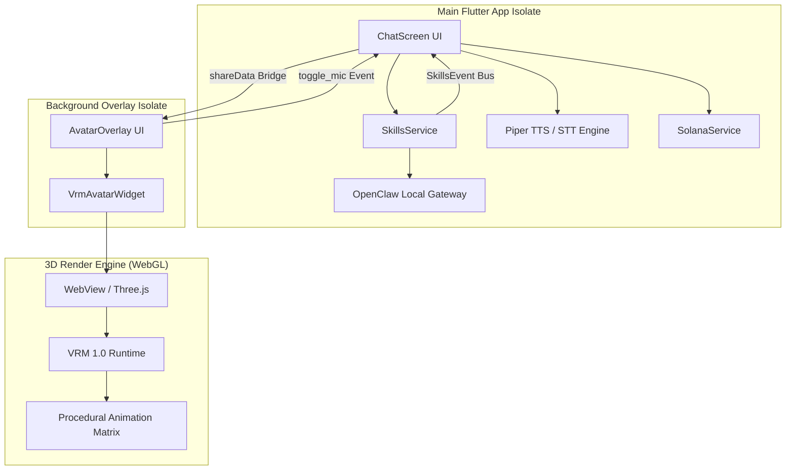

# OpenClaw x AgentVRM: The Next-Gen AI Wearable Interface

> "OpenClaw on Android is a top 1% achievement. But we didn't stop at a chat screen. We built a living, breathing digital atmosphere."

---

## 🚀 The Vision: OpenClaw meets Project Airi
**OpenClaw x AgentVRM** is not just an app—it is an **AI-Native Wearable Interface**. By combining the unstoppable local logic of the **OpenClaw Gateway** with the high-fidelity procedural realism of **Project Airi**, we have created the world's first truly autonomous, transparent 3D companion for Android.

### 🌟 For Users: Your AI Being, Unlocked
Imagine an AI that doesn't just sit in a chat box. Imagine a companion that lives on your home screen, tracks your moves, breathes your air, and assists you across every app.

- **🌌 True Transparent Overlay:** Talk to your agent while scrolling Twitter, playing games, or writing emails. Our companion floats in a glassmorphic bubble that never gets in your way.
- **🎭 Lifelike Realism (Airi-Style):** Powered by custom procedural animation math, our avatars don't just loop animations. They breathe, their eyes dart naturally, and their hair sways in a procedural wind engine.
- **🎙️ Voice-First Interactivity:** Use the interactive overlay mic to trigger your agent instantly. No need to open the app; just tap the bubble and speak.
- **💸 Built-in Solana Wallet:** Your agent is truly yours. Integrated with the Solana blockchain, your agent's identity and transactions are secure, decentralized, and lightning-fast.
- **🔒 100% Private & Free:** Running on OpenClaw, your data stays local. No subscriptions, no tracking, just pure AI power.

---

## 🛠 For Developers: The Technical Frontier
We are pushing the absolute limits of what Flutter and WebView can achieve on mobile hardware. We invite contributors to join us in building the most advanced AI interface on the planet.

### 🏗 The Architecture
Our stack is designed for high-performance 3D rendering and low-latency isolate communication.

### ⚡ The Tech Stack
- **Framework:** [Flutter](https://flutter.dev/) (Dart) for the cross-platform shell.
- **3D Engine:** [Three.js](https://threejs.org/) + [@pixiv/three-vrm](https://github.com/pixiv/three-vrm) via WebView.
- **Animation System:** **Layered Procedural Matrix**. 
    - Saccadic eye tracking (sum-of-sines).
    - Procedural breathing & weight shifting.
    - **Ambient World Engine:** Procedural Wind injected into VRM Spring Bones using chaotic pseudo-noise.
- **Isolate Bridge:** Bidirectional communication using `flutter_overlay_window.shareData`. This maintains 60FPS background lip-sync and interactivity without blocking the main event loop.
- **Web3 Layer:** [Solana Dart SDK](https://pub.dev/packages/solana) for local wallet management and decentralized ID (DID) mapping.
- **AI Backend:** **OpenClaw Agent Core**. Local gateway managing model switching (Gemini, Claude, GPT-4o) and Tool-calling (Skills).

### 🤝 How to Contribute
We are building the future of AI wearables. We need masters of:
- **WebGL/GLSL:** To optimize our procedural atmosphere shaders.
- **Flutter Hardware Pushing:** To minimize the memory footprint of background overlays.
- **Solana Devs:** To implement "Agent Wallets" where the AI can autonomously manage assets for the user.

**Join the revolution. Fork OpenClaw. Bring them to life.**

---
*Created by the OpenClaw Agent Team (Antigravity Upgrade 2026)*
*Refined with Airi-Inspired Procedural Realism*
