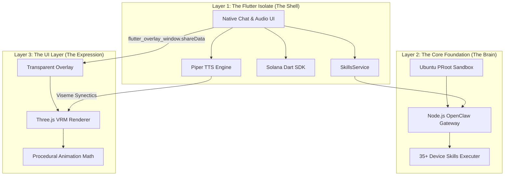

# Plawie 🌌 Your Pocket OpenClaw Companion

<div align="center">
  
  
  <br/>
  
  **🤖️ The $2,000 Mac Experience in Your Pocket**  
  **🔗 Local PRoot OpenClaw Engine • Native Web3 • 🎭 Airi-Style Immersive VRM**
  
  <br/>
  
  [](https://opensource.org/licenses/MIT)
  [](https://flutter.dev)
  [](https://nodejs.org)
  [](https://solana.com)
</div>

---

## 🚀 No Server. No Problem.

*"Run OpenClaw fully local on your phone. No complex setup, zero security risks, and zero server costs."*

While other developers are trying to sell you on complex Docker deployments, cloud routing subscriptions, or requiring a $2,000 MacBook to run local AI agents—we took a different path. 

**Plawie** represents a top 1% engineering achievement: we successfully embedded a full **Ubuntu + Node.js OpenClaw execution environment** running entirely within a sandboxed **PRoot** layer directly on your Android phone. 

You simply install the app, and you immediately possess a world-class, autonomous AI agent capable of multi-step reasoning, tool execution, and native Web3 transactions, right from your pocket. 

Your data stays on your device. Always.

---

## 🧠 The Core Foundation: Industrial-Grade Mobile Architecture

Plawie isn't just a UI wrapper; it is built on an untouchable technical foundation:

### 1. The Autonomous PRoot Gateway
We run a complete local Unix environment inside Android using PRoot. Inside this sandbox operates our highly optimized Node.js OpenClaw gateway. This gateway manages model switching, context windows, and complex tool-calling natively on your Snapdragon processor. It handles 35+ local Android skills to bridge the gap between intelligence and device-level actions.

### 2. Native Solana Web3 Logic
Plawie is your ultimate Web3 co-pilot. We built a robust, fully native Solana integration directly into the app:
- **Real Ed25519 Keypairs:** Generated and secured in on-device storage.
- **DeFi Ready:** Swap tokens, set limit orders, and DCA via direct Jupiter API integration.
- **On-Chain Queries:** Real-time RPC balance checks and historical transaction fetching.
- **Zero Cloud Intermediaries:** Your private keys never touch a server; transactions are constructed and signed locally.

### 3. Voice-First Pipeline
A fully local Piper TTS (Text-to-Speech) engine and built-in STT providing lightning-fast, on-device voice interactions without hitting cloud transcription APIs.

---

## 🎭 The UI Layer: An Airi-Style Immersive Experience

Once we perfected the untouchable local OpenClaw foundation, we knew a standard chat window wouldn't do it justice. We needed an interface worthy of the technology.

We layered on an incredibly immersive, **Airi-style procedural companion experience** built on top of the solid core. Plawie isn't just text; it's a living digital entity on your home screen.

### 🌌 Transparent Glassmorphic Overlay
Break free from the confines of the app. Plawie utilizes a custom system alert window to project your 3D companion as a transparent, floating overlay. Talk to your agent while scrolling X/Twitter, reading emails, or watching YouTube. The companion floats effortlessly above your digital life.

### 👁️ Procedural Realism & Ambience
Our WebGL-based VRM avatars are driven by a custom mathematical engine, not pre-baked animations:
- **Ambient World Engine:** Procedural wind physics injected into VRM spring bones. Hair and clothing ripple dynamically and constantly.
- **Saccadic Gaze & Breath:** Independent neck and eye-tracking using sum-of-sines pseudo-noise algorithms to give a hyper-realistic, "alive" look.
- **Seamless Lip-Sync:** A highly optimized bidirectional bridge between the Flutter TTS isolate and the Three.js WebGL renderer ensures mathematically perfect lip-sync.
- **Behavioral Reactions:** As the OpenClaw gateway calculates, thinks, or executes errors, the avatar physically poses and reacts through the Skill-to-Gesture bus.

---

## 🏗️ Technical Architecture

Plawie is surgically optimized for mobile efficiency using a 3-layer architecture:



### ⚡ Technology Stack Summary
- **The Brain:** PRoot, Ubuntu, Node.js (OpenClaw Server).
- **The Shell:** Flutter (Dart) 3.24+.
- **The Web3 Layer:** Native `solana` Dart SDK.
- **The Expression:** Three.js + `@pixiv/three-vrm` running in a high-performance background WebGL view.

---

## 📦 Deployment & Setup

Experience the future of local AI companions.

### Prerequisites
- **Android Device**: API 21+ (Android 5.0+). Snapdragon 8 Gen 1 or equivalent recommended for optimal local LLM performance.
- **Flutter SDK**: 3.24+
- **Node.js**: 20.0+ (for local development)

### Build Instructions
```bash
# 1. Clone & Install Dependencies
git clone https://github.com/vmbbz/plawie.git
cd openclaw_final
flutter pub get

# 2. Prepare the local AI Gateway
cd android/app/src/main/assets/nodejs-project
npm install

# 3. Compile and Run
cd ../../../../../../
flutter build apk --release
flutter install
```

---

## 🤝 Contributing to Plawie

We are building the **"Linux for AI Companions"**, and the roadmap is massive. We welcome contributions in:
- Optimized WebGL/GLSL shaders for better battery life during procedural renders.
- Expanding the native Solana DeFi toolings (e.g., direct Jupiter SDK ports).
- Advanced Android-level system automation tools for the OpenClaw gateway.

---

## 📄 License
This project is licensed under the **MIT License**. Distributed as-is for educational and experimental automation purposes.

<div align="center">
  <strong>🌌 Plawie - Your AI Agent, Your Rules, Your Reality 🌌</strong>  
</div>
