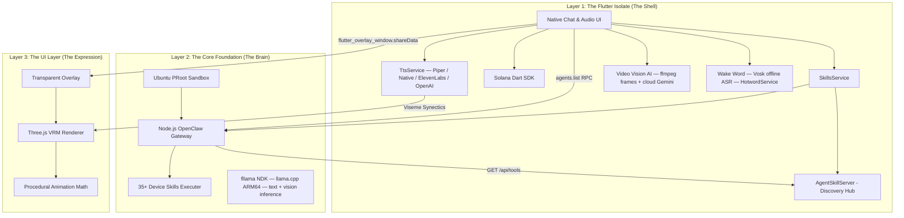

# Plawie — Your Pocket OpenClaw Companion

<div align="center">
  
  
  <br/>
  
  **🤖️ The $2,000 Mac Experience in Your Pocket**  
  **🔗 Local PRoot OpenClaw Engine • Native Web3 • 🎭 Airi-Style Immersive VRM**
  
  <br/>
  
  [](https://opensource.org/licenses/MIT)
  [](https://flutter.dev)
  [](https://nodejs.org)
  [](https://solana.com)
</div>

---

**"Run OpenClaw fully local on your phone. Always-on, totally private, and under your absolute control."**

While other developers are trying to sell you on complex Docker deployments, cloud routing subscriptions, or requiring a $2,000 MacBook to run local AI agents—we took a different path. 

**Plawie** represents a top 1% engineering achievement: we successfully embedded a full **Ubuntu + Node.js OpenClaw execution environment** running entirely within a sandboxed **PRoot** layer directly on your Android phone. 

You simply install the app, and you immediately possess a world-class, autonomous AI agent capable of multi-step reasoning, tool execution, and native Web3 transactions, right from your pocket. 

Your data stays on your device. Always.

---

## 🧠 The Core Foundation: Industrial-Grade Mobile Architecture

Plawie isn't just a UI wrapper; it is built on an untouchable technical foundation:

### 1. The Autonomous PRoot Gateway
We run a complete local Unix environment inside Android using PRoot. Inside this sandbox operates our highly optimized Node.js OpenClaw gateway. This gateway manages model switching, context windows, and complex tool-calling natively on your Snapdragon processor. It handles 35+ local Android skills to bridge the gap between intelligence and device-level actions.

### 3. Industrial-Grade Background Stability
Plawie is built for 24/7 autonomous operation. Unlike standard apps that die when you swipe them away:
- **Sticky Foreground Services**: The OpenClaw engine runs as a high-priority Android service, surviving app closures and background pruning.
- **Actionable Notifications**: Control your bot directly from the notification shade with **STOP** and **RESTART** buttons—no need to open the app.
- **Boot Persistence**: If enabled, Plawie automatically revives your gateway and node processes the moment your phone restarts and unlocks.
- **Process Watchdog**: An intelligent monitor that detects gateway failures and self-heals the environment within seconds.

### 4. Native Solana Web3 Logic
Plawie is your ultimate Web3 co-pilot. We built a robust, fully native Solana integration directly into the app:
- **Real Ed25519 Keypairs:** Generated and secured in on-device storage.
- **DeFi Ready:** Swap tokens, set limit orders, and DCA via direct Jupiter API integration.
- **On-Chain Queries:** Real-time RPC balance checks and historical transaction fetching.
- **Zero Cloud Intermediaries:** Your private keys never touch a server; transactions are constructed and signed locally.

### 3. Voice-First Intelligence Pipeline

Plawie ships a complete, multi-engine voice stack that puts you in full control — no cloud dependency required:

- **4 TTS Engines** — Switch between Piper (fully offline, ONNX VITS), Android Native TTS (uses device voices), ElevenLabs (ultra-realistic cloud), or OpenAI TTS (13 voices) from Settings.
- **Speech Speed Control** — Smooth 0.5×–2.0× speed slider, persisted across sessions.
- **Continuous Mode** — After TTS finishes speaking, the mic automatically restarts. Enables truly hands-free, back-and-forth conversations with your agent.
- **Configurable Silence Timeout** — 1s–15s slider controls how long Plawie waits before auto-submitting your speech.
- **Wake Word "Plawie"** — Say *"Plawie"* or *"Hey Plawie"* to activate the mic from anywhere, entirely offline using the Vosk ASR engine (Grammar-constrained to near-zero false positives).

### 4. Video Vision AI

Your agent can see the world around you:

- **📷 Photo** — Attach any camera snapshot to a message; routed to local multimodal LLM (LLaVA / Qwen2-VL) or cloud Gemini automatically.
- **📹 Video Clips** — Record 2–30s clips, extract key frames via PRoot `ffmpeg`, analyse each frame with the local vision model, then produce a coherent summary — 100% offline.
- **Cloud Fallback** — When no local vision model is active, video is sent inline (base64 MP4) to Gemini 1.5 / 2.0 Pro via the OpenClaw gateway for cloud-grade analysis.

### 5. Integrated Agent Hub (Ollama)

Beyond the NDK-based fllama engine, Plawie includes a full, native **Ollama Hub** running inside the PRoot sandbox. This provides a standard OpenAI-compatible REST API for the OpenClaw gateway, enabling:
- **Zero-Config Setup**: One-tap installation of the official Ollama Linux ARM64 binary.
- **GGUF Bridging**: Instantly register existing GGUF models as Ollama models using our "Zero-Copy" sync bridge.
- **Library Discovery**: Pull any model from the [Ollama Library](https://ollama.com/library) directly onto your device.

---

## 🎭 The UI Layer: An Airi-Style Immersive Experience

Once we perfected the untouchable local OpenClaw foundation, we knew a standard chat window wouldn't do it justice. We needed an interface worthy of the technology.

We layered on an incredibly immersive, **Airi-style procedural companion experience** built on top of the solid core. Plawie isn't just text; it's a living digital entity on your home screen.

### 🌌 Transparent Glassmorphic Overlay
Break free from the confines of the app. Plawie utilizes a custom system alert window to project your 3D companion as a transparent, floating overlay. Talk to your agent while scrolling X/Twitter, reading emails, or watching YouTube. The companion floats effortlessly above your digital life.

### 👁️ Procedural Realism & Ambience
Our WebGL-based VRM avatars are driven by a custom mathematical engine, not pre-baked animations:
- **Ambient World Engine:** Procedural wind physics injected into VRM spring bones. Hair and clothing ripple dynamically and constantly.
- **Saccadic Gaze & Breath:** Independent neck and eye-tracking using sum-of-sines pseudo-noise algorithms to give a hyper-realistic, "alive" look.
- **Seamless Lip-Sync:** A highly optimized bidirectional bridge between the Flutter TTS isolate and the Three.js WebGL renderer ensures mathematically perfect lip-sync.
- **Behavioral Reactions:** As the OpenClaw gateway calculates, thinks, or executes errors, the avatar physically poses and reacts through the Skill-to-Gesture bus.

---

## 🛠️ The Bot Management Suite: High-Fidelity Control

Plawie includes a full-featured, glassmorphic management dashboard to monitor and command your agent fleet:

### 1. Unified Control Plane
A premium dashboard with domain-specific icons (System, Config, Agents) providing live health metrics, connection state, and RPC latency tracking.

### 2. Config & Agent Manager
An interactive `JsonEditor` allows you to manage `openclaw.json` and your agent configurations directly on-device. No SSH or command-line required for tuning your agents.

### 3. Premium Agent Skills (Claude Standard)

We've integrated high-fidelity, functional skills standardized for Claude's "Tool Use" protocol:

| Skill | Provider | What Your Agent Can Do |
|-------|----------|------------------------|
| 💳 **Wallet** | AgentCard.ai | Issue virtual Visa cards, top up & spend autonomously on Base |
| 🔨 **Work** | MoltLaunch | Browse & bid on on-chain AI jobs, receive ETH escrow payments |
| 🛡️ **Credit** | Valeo Sentinel | x402 budget caps (per-call / hourly / daily), full audit log |
| 📞 **Calls** | Twilio AI | Inbound & outbound voice via ConversationRelay, real-time transcription |
| 💸 **Finance** | MoonPay Agents | Buy, sell, swap, bridge crypto • portfolio check • DCA strategies • live prices |
| 🧠 **Local LLM** | fllama NDK | Free, offline, on-device inference via Qwen2.5 — llama.cpp ARM64, no API key, no internet, instant start |

#### 🌙 MoonPay Agents — Agent Banking

MoonPay gives your AI a **verified bank account and 30+ financial skills** via the `@moonpay/cli` MCP server. Once configured in OpenClaw, your agent gains natural-language access to:

- **Portfolio checks** — multi-chain wallet balances across ETH / BTC / SOL / USDC
- **Token swaps** — on-chain via `moonpay.swap { from_token, to_token, amount }`
- **Cross-chain bridges** — via `moonpay.bridge { token, from_chain, to_chain, amount }`
- **Fiat onramps/offramps** — `moonpay.buy / moonpay.sell`
- **DCA strategies** — `moonpay.dca_create { token, amount_usd, frequency }`
- **Live market prices** — `moonpay.get_price { token }`

```bash
# Setup (one-time, run on your device via OpenClaw terminal)
npm install -g @moonpay/cli
mp login
mp wallet create MyWallet
mp skill install   # installs OpenClaw-optimised skill prompts
```

```yaml
# openclaw.yaml — add MoonPay as MCP server
mcp:
  servers:
    - name: moonpay
      command: mp
      args: [mcp]
```

> **Security:** Your private keys stay on your device. MoonPay CLI signs all transactions locally. Nothing leaves your hardware.

- **Discovery Engine**: Native `/api/tools` endpoint for "Progressive Disclosure" skill loading.

---

#### 🧠 Local LLM — Free On-Device Inference

Plawie runs a **completely free, offline LLM** directly on your device via the **[fllama](https://github.com/Telosnex/fllama) NDK plugin** — llama.cpp compiled as a native ARM64 `.so` inside the APK. No PRoot, no HTTP server, no compilation step, no internet required after model download.

**How it works:**
- fllama is a Flutter plugin that ships llama.cpp as a pre-compiled Android ARM64 native library.
- A GGUF model is downloaded on first use (not bundled in the APK — models are 400 MB–4 GB).
- Inference runs via a direct Dart→NDK call. The model activates in under 1 second.
- Multi-turn tool-use (function calling) is supported — the model can call local tools (e.g. `get_current_datetime`) and recurse up to 3 turns automatically.
- Cloud APIs remain available as fallback at any time.

**Recommended model:** `Qwen2.5-1.5B-Instruct-Q4_K_M` (~1 GB download, ~15–22 tok/s on Snapdragon 8 Gen 2)

**Setup via Agent Skills → Local LLM in the app:**
1. Tap **Local LLM** in the Agent Skills grid
2. Select a model from the catalog and tap **Download** (400 MB–1 GB, one-time)
3. Tap **Activate** — the model loads in under 1 second, no compilation required
4. Chat directly — the local model handles all inference on-device

| Device Tier | RAM | SoC | Speed (1.5B Q4_K_M) |
|-------------|-----|-----|----------------------|
| Minimum | 6 GB | SD 7 Gen 1 | ~4–8 tok/s |
| Recommended | 12 GB | SD 8 Gen 2 | ~15–22 tok/s |
| Optimal | 16 GB | SD 8 Elite | ~22–35 tok/s |

> GPU/Vulkan acceleration (Phase 2) will target 3–5× throughput on Adreno 730+.
> See `ARCHITECTURE_LOCAL_LLM.md` for the full engineering reference, performance benchmarks, and roadmap.


## 🏗️ Technical Architecture

Plawie is surgically optimized for mobile efficiency using a 3-layer architecture:



### ⚡ Technology Stack Summary
- **The Gateway:** PRoot + Ubuntu ARM64 + Node.js v20+ — OpenClaw AI gateway, 35+ device skills, cloud model routing.
- **The Local LLM:** [fllama](https://github.com/Telosnex/fllama) — llama.cpp compiled as native ARM64 `.so` via Android NDK. Text inference, vision inference (LLaVA/Qwen2-VL), multi-turn tool-use. No HTTP server, no PRoot dependency, instant activation.
- **The Voice:** TtsService facade (Piper VITS offline · Android TTS · ElevenLabs · OpenAI TTS).
- **The Wake Word:** Vosk offline ASR — `HotwordService` Android foreground service.
- **The Hub:** AgentSkillServer (Standardized Loopback Discovery).
- **The Shell:** Flutter (Dart) 3.24+ · minSdk 29 (Android 10+).
- **The Web3 Layer:** Native `solana` Dart SDK · Jupiter Ultra API · MoonPay MCP.
- **The Expression:** Three.js + VRM bone-tracking renderer (WebGL).

---

## 📦 Deployment & Setup

Experience the future of local AI companions.

### Prerequisites
- **Android Device**: API 29+ (Android 10+). Snapdragon 8 Gen 1 or newer with 8 GB+ RAM recommended for Local LLM. Any Android 10+ device works for cloud-only mode.
- **Flutter SDK**: 3.24+
- **Android NDK**: 28.2.13676358 (installed automatically by Android Studio / SDK Manager)
- **Node.js**: 20.0+ (for local development only)

### Build Instructions
```bash
# 1. Clone & install Flutter dependencies
git clone https://github.com/vmbbz/plawie.git
cd openclaw_final
flutter pub get

# 2. Build (fllama NDK compiles automatically on first build — takes ~30s incremental)
flutter build apk --release

# 3. Install
flutter install
```

> **First build note:** `flutter pub get` triggers fllama's Dart native-asset hook which compiles llama.cpp for ARM64 via the Android NDK. This takes 3–5 minutes on first run and is fully cached for subsequent builds.

---

## 🤝 Contributing to Plawie

We are building the **"Linux for AI Companions"**, and the roadmap is massive. We welcome contributions in:
- On-device local LLM stability, model benchmarks, and GPU acceleration via native Android host (see `ARCHITECTURE_LOCAL_LLM.md`)
- Optimized WebGL/GLSL shaders for better battery life during procedural renders.
- Expanding the native Solana DeFi toolings (e.g., direct Jupiter SDK ports).
- Advanced Android-level system automation tools for the OpenClaw gateway.

---

## 📄 License
This project is licensed under the **MIT License**. Distributed as-is for educational and experimental automation purposes.

<div align="center">
  <strong>🌌 Plawie - Your AI Agent, Your Rules, Your Reality 🌌</strong>  
</div>
