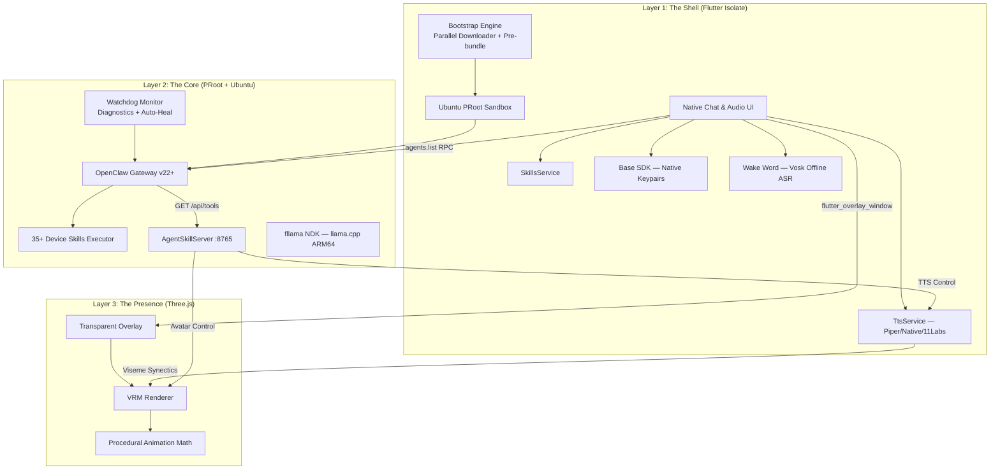

# Plawie — Your Pocket OpenClaw

<div align="center">
  <p align="center">
    
  </p>
  
  <br/>
  
  <h3>The World's Most Powerful Autonomous Agent Experience for Android</h3>
  
  **The full OpenClaw Agentic Experience — cloud-capable, private when you need it, in your pocket.**  
  **Gateway tools for power. NDK offline mode for privacy. One Android app.**

  <br/>

  [](https://opensource.org/licenses/MIT)
  [](https://github.com/vmbbz/plawie/releases/latest)
  [](https://github.com/vmbbz/plawie/tree/feat/project-aegis)
  [](https://github.com/vmbbz/plawie)
  [](https://github.com/vmbbz/plawie)
  [](https://flutter.dev)
  [](https://nodejs.org)
  [](https://base.org)
  [](https://github.com/vmbbz/plawie/graphs/commit-activity)
</div>

---

## 🚀 Project Aegis: Phase 1 (v2.1.0-beta.2)

<p align="center">
  
</p>

We are currently in **Phase 1** of Project Aegis. This phase hardens the existing PRoot infrastructure while laying the groundwork for a native glibc engine:
- **🛡️ Loopback Hardening** — Forced `127.0.0.1` binding for industrial-grade stability and security.
- **📈 Granular Progress** — Real-time sub-step reporting during the complex "Setting Up" phase.
- **🎭 Dynamic Logo** — State-aware UI that switches from an animated "Installing" logo to the premium Avatar the moment the gateway is healthy.

*The Aegis Roadmap: Minimal Footprint. Maximum Power.*

---

**"Run an OpenClaw gateway on your Android phone, pair native device skills, and choose between full cloud-agent power or private on-device NDK chat."**

While other developers are trying to sell you on complex Docker deployments, cloud routing subscriptions, or requiring a MacBook to run OpenClaw, we took a different path.

**Plawie** provides a full **Ubuntu + Node.js OpenClaw execution environment** running entirely within a sandboxed **PRoot** layer directly on your Android phone.

You install the app, pick a supported provider key for full Gateway Agent Mode, and immediately get a world-class autonomous AI experience capable of multi-step reasoning, tool execution, and native Web3 transactions from your pocket. When you want private offline chat, switch to the NDK Local LLM mode.

---

## ✨ What Makes Plawie Special

- **🤖 OpenClaw Gateway + Offline NDK** — Runs the Gateway in hardened PRoot and keeps private local inference in native fllama mode.
- **🎭 State-Aware UI** — Dynamic logo transition from animated "Installing" circuit to 3D Avatar reveal.
- **Immersive VRM Avatar** — 3D digital companion with procedural gestures and perfect lip-sync.
- **🖼️ Hologram Presenter** — Beautiful floating overlays for canvas, images, web previews, and media.
- **🎙️ Voice-First Intelligence** — Continuous listening, wake word, and multiple offline TTS engines.
- **📱 Native Device Skills** — 35+ tools including Camera, Location, Haptics, Sensors, and Terminal Shell.
- **🔗 Web3 Ready** — On-chain actions, MoonPay integration, and native **Base** L2 support.
- **📈 Precision Progress** — Granular status updates using monospaced terminal-style fonts for better observability.
- **🛡️ Production Logging** — High-performance, linter-compliant `debugPrint` infrastructure across all services.

---

## 📱 The Experience

Plawie isn't just an app; it's a living digital entity. It combines industrial-grade Linux automation with a premium, glassmorphic user interface.

<div align="center">
  <table>
    <tr>
      <td width="33%"><br/><sub><b>Immersive Chat</b></sub></td>
      <td width="33%"><br/><sub><b>Real-time Dashboard</b></sub></td>
      <td width="33%"><br/><sub><b>Real-time Logs</b></sub></td>
    </tr>
    <tr>
      <td width="33%"><br/><sub><b>35+ Native Skills</b></sub></td>
      <td width="33%"><br/><sub><b>Offline Inference</b></sub></td>
      <td width="33%"><br/><sub><b>Multi-Agent Fleet</b></sub></td>
    </tr>
  </table>
</div>

---

## 🚀 Quick Start

1. **Download** the latest APK from [Releases](https://github.com/vmbbz/plawie/releases/latest).
2. **Install** on any device running Android 10+.
3. **Launch** → choose Gemini, Claude, OpenAI, Grok, OpenRouter, or Groq and add your own provider key.
4. **Install** → Plawie sets up the hardened PRoot Gateway and pairs the local device node.
5. **Start Chatting** with your personal AI companion.

> **Pro Tip:** Use **Cloud Agent Mode** for full OpenClaw skills/tools/dashboard. Use **Local LLM** only when you want private offline NDK chat.

---

## 🧠 The Core Foundation: Industrial-Grade Mobile Architecture

Plawie isn't just a UI wrapper; it is built on an untouchable technical foundation:

### 1. The Autonomous PRoot Gateway
We run a complete local Unix environment inside Android using PRoot. Inside this sandbox operates our highly optimized Node.js OpenClaw gateway. This gateway manages provider routing, sessions, tools, skills, and dashboard access while the Flutter app pairs as a native device node.

**Specifications:**
- **OS Layer**: Hardened Ubuntu 24.04 (PRoot Sandbox)
- **Runtime**: Node.js v22.22.2 LTS (High-Performance AI Gateway)
- **Bootstrap**: Parallel Multi-Threaded Engine (<40s Setup)
- **Footprint**: Ephemeral Build Lifecycle (Saves 800MB+ storage)

#### Gateway Configuration
The gateway uses official OpenClaw configuration schema validated against community best practices:

**Key Configuration Settings:**
- **`gateway.bind: 'loopback'`** - Enforced local-only binding (127.0.0.1). Resolves PRoot network stability issues.
- **`gateway.nodes.pairing.autoApproveCidrs: ['127.0.0.1/32']`** - Auto-approve localhost connections only
- **`gateway.mode: 'local'`** - Local execution mode for mobile privacy
- **`gateway.port: 18789`** - Standard OpenClaw port (configurable)

**Security Features:**
- **Loopback Enforcement**: Prevents unauthorized network access and interface detection failures.
- **CIDR Restriction**: Auto-approval is strictly limited to localhost.
- **Origin Hardening**: No `allowedOrigins` required for loopback mode, reducing the attack surface.
- Config validation prevents invalid schema values

### 2. Precision Background Stability
Plawie is built for 24/7 autonomous operation. Unlike standard apps that die when backgrounded:
- **Sticky Foreground Services**: The OpenClaw engine runs as a high-priority Android service, surviving app closures and "Doze" mode.
- **Actionable Notifications**: Control your agent (STOP/RESTART) directly from the notification shade.
- **Proactive Self-Healing**: An intelligent watchdog monitor triggers a surgical "Auto-Repair" sequence in under 3 seconds if dependencies are missing.
- **Pro Storage Opt-in**: Granular security model allowing users to opt-in to **"All Files Access"** for direct `/sdcard` mounting.

### 3. Native Base Web3 Logic
Plawie is your ultimate Web3 co-pilot. We built a robust, fully native **Base (Ethereum L2)** integration directly into the app:
- **Real Keypairs:** Generated and secured in on-device storage.
- **DeFi Ready:** Swap tokens, set limit orders, and DCA via direct integration.
- **On-Chain Queries:** Real-time RPC balance checks and historical transaction fetching.
- **Zero Cloud Intermediaries:** Your private keys never touch a server; transactions are constructed and signed locally.

### 4. Hybrid Voice Pipeline (Gateway-First)
Plawie ships with a production-grade, multi-engine voice stack designed for high performance and minimal footprint:
- **☁️ Cloud Voices** — Default high-fidelity voices streamed directly from the OpenClaw Gateway.
- **🔇 Offline Voices (Piper)** — Professional-grade on-device speech generation. Models are downloaded on-demand (e.g., Lessac-High, Amy-Medium) to keep the base APK lean.
- **🎙️ Gateway-STT** — Transcription is offloaded to the OpenClaw Gateway, ensuring high accuracy and consistent reasoning across all agent interactions.
- **🗣️ Speech Speed Control** — Smooth 0.5×–2.0× speed slider, persisted across sessions.
- **🔄 Continuous Mode** — Optional back-and-forth hands-free conversation logic.
- **🐕 Wake Word "Plawie"** — Activate the mic entirely offline using the Vosk ASR engine.

### 5. Video Vision AI
Your agent can see the world around you:
- **📷 Photo** — Attach any camera snapshot to a message; routed to local multimodal LLM or cloud Gemini.
- **📹 Video Clips** — Record 2–30s clips, extract key frames via PRoot `ffmpeg`, analyse each frame with the local vision model, then produce a coherent summary — 100% offline.
- **Cloud Fallback** — When no local vision path is active, media is routed through the selected cloud provider.

### 6. Private Offline LLM (NDK)
Plawie keeps local inference lightweight and honest:
- **NDK Direct**: GGUF models run through fllama / llama.cpp inside the app.
- **No Hidden Daemon**: No embedded Ollama runtime is downloaded during setup.
- **Private Mode**: Local turns bypass the OpenClaw Gateway and stay on-device.
- **Clear Split**: Use cloud Gateway models for full tools, skills, and dashboard; use `local-llm/` for offline privacy.

---

## 🎭 The UI Layer: An Airi-Style Immersive Experience

Once we perfected the foundation, we created an interface worthy of the technology.

### 🌌 Transparent Glassmorphic Overlay
Break free from the confines of the app. Plawie utilizes a custom system alert window to project your 3D companion as a transparent, floating overlay. Talk to your agent while scrolling X/Twitter or reading emails.

### 👁️ Procedural Realism & Ambience
Our WebGL-based VRM avatars are driven by a custom mathematical engine, not pre-baked animations:
- **Ambient World Engine:** Procedural wind physics injected into VRM spring bones. Hair and clothing ripple dynamically and constantly.
- **Saccadic Gaze & Breath:** Independent neck and eye-tracking using sum-of-sines algorithms to give a hyper-realistic, "alive" look.
- **Seamless Lip-Sync:** A highly optimized bidirectional bridge between the Flutter TTS isolate and the Three.js WebGL renderer ensures mathematically perfect lip-sync.
- **Behavioral Reactions:** As the OpenClaw gateway calculates or executes tools, the avatar physically poses and reacts through the Skill-to-Gesture bus.

---

## 🛠️ Agent Skills System: Three-Layer Architecture

Plawie implements a clean architecture that separates *what* the agent can do from *how*:

| Concept | What it is | Where it lives |
|---------|-----------|----------------|
| **Skills** | npm packages for capabilities (weather, GitHub...) | `~/.openclaw/node_modules/@openclaw/` |
| **Tools** | OS-level primitives (browser, files, search...). | `openclaw.json → tools.allow[]` |
| **Custom App Skills** | Flutter-native skills wired directly into Android | `AgentSkillServer` on `127.0.0.1:8765` |

### Layer 1 — Gateway Skills (ClawHub)
Install any community skill from the ClawHub registry directly from the **Discover** tab:
```bash
# Via terminal (OpenClaw terminal screen):
openclaw skills install weather
openclaw skills install github
openclaw skills install coding-agent
```

### Layer 2 — Premium Partner Skills
Pre-wired high-value skills executed via `GatewaySkillProxy` WebSocket RPC:

| Skill | Provider | What Your Agent Can Do |
|-------|----------|------------------------|
| 💳 **Wallet** | AgentCard.ai | Issue virtual Visa cards, top up & spend autonomously on Base |
| 🔨 **Work** | MoltLaunch | Browse & bid on on-chain AI jobs, receive ETH escrow payments |
| 🛡️ **Credit** | Valeo Sentinel | x402 budget caps (per-call / hourly / daily), full audit log |
| 📞 **Calls** | Twilio AI | Inbound & outbound voice via ConversationRelay, real-time transcription |
| 💸 **Finance** | MoonPay Agents | Buy, sell, swap, bridge crypto • portfolio check • DCA strategies |

### Layer 3 — Custom App Skills (Device-Native)
- **🎭 `avatar-control`** — Control the live VRM companion: `change_model | play_gesture (wave, nod, shake) | set_emotion (happy, sad)`.
- **🔊 `tts-voice`** — Switch the speech engine or voice mid-conversation.
- **📱 `device-node`** — Hardware access: `vibrate | flashlight | battery | location | read_sensor | take_photo`.

---

## 🔐 Web Dashboard — Authenticated Access

The Web Dashboard opens OpenClaw's built-in admin UI inside a secure WebView. Authentication is fully automatic:
1. When the gateway starts, Plawie eagerly calls `openclaw dashboard --no-open` to retrieve a live auth token.
2. The token is cached in SharedPreferences so subsequent opens are **instant**.
3. If the cached token is stale, `WebDashboardScreen` forces a fresh CLI probe.

---

## 🏗️ Technical Architecture

Plawie is surgically optimized for mobile efficiency using a 4-tier architecture:


```mermaid
graph TD
    subgraph "Layer 1: The Shell (Flutter Isolate)"
        A[Native Chat & Audio UI] --> B[SkillsService]
        A --> C[Base SDK — Native Keypairs]
        A --> D[TtsService — Piper/Native/11Labs]
        A --> W[Wake Word — Vosk Offline ASR]
        Z["Bootstrap Engine\nParallel Downloader + Pre-bundle"] --> E
    end

    subgraph "Layer 2: The Core (PRoot + Ubuntu)"
        E[Ubuntu PRoot Sandbox] --> F[OpenClaw Gateway v22+]
        F --> G[35+ Device Skills Executor]
        F -- "GET /api/tools" --> K
        L[fllama NDK — llama.cpp ARM64]
        M["Watchdog Monitor\nDiagnostics + Auto-Heal"] --> F
    end

    subgraph "Layer 3: The Presence (Three.js)"
        H[Transparent Overlay] --> I[VRM Renderer]
        I --> J[Procedural Animation Math]
    end

    A -- "flutter_overlay_window" --> H
    D -- "Viseme Synectics" --> I
    A -- "agents.list RPC" --> F
    K[AgentSkillServer :8765] -- "Avatar Control" --> I
    K -- "TTS Control" --> D
```

---

## 🧠 Local LLM — Free On-Device Inference

Plawie runs a **completely free, offline LLM** directly on your device via the **fllama NDK plugin**. No PRoot, no HTTP server, no internet required after model download.

| Device Tier | RAM | SoC | Speed (1.5B Q4_K_M) |
|-------------|-----|-----|----------------------|
| Minimum | 6 GB | SD 7 Gen 1 | ~4–8 tok/s |
| Recommended | 12 GB | SD 8 Gen 2 | ~15–22 tok/s |
| Optimal | 16 GB | SD 8 Elite | ~22–35 tok/s |

---

## 🌙 MoonPay Agents — Agent Banking

MoonPay gives your AI a **verified bank account and 30+ financial skills** via the `@moonpay/cli` MCP server.

```bash
# Setup (run on device via terminal)
npm install -g @moonpay/cli
mp login
mp wallet create MyWallet
mp skill install
```

```yaml
# openclaw.yaml — add MoonPay as MCP server
mcp:
  servers:
    - name: moonpay
      command: mp
      args: [mcp]
```

---

## 📦 Deployment & Setup

### Prerequisites
- **Android Device**: API 29+ (Android 10+). Snapdragon 8 Gen 1+ with 8 GB+ RAM recommended.
- **Flutter SDK**: 3.24+
- **Android NDK**: 28.2.13676358

### Build Instructions
```bash
# 1. Clone & install Flutter dependencies
git clone https://github.com/vmbbz/plawie.git
flutter pub get

# 2. Build for production (ARM64)
flutter build apk --release --target-platform android-arm64
```

---

## 🚀 Post-Installation: First Run

#### Mode A — OpenClaw Gateway Chat (Full Tools + Skills)
1. **Start Gateway** — tap **Start** on the home screen.
2. **Set Your API Key** — go to **Settings → API Provider**.
3. **Start Chatting** — select any cloud model. Full tool-use is available immediately.

#### Mode B — Local NDK Chat (fllama, No Internet)
1. **Local LLM** → Download a model (e.g. Qwen2.5-1.5B).
2. **Select** the model as active.
3. **In Chat**, select the `local-llm/` model. Direct NDK streaming.

---

## 🤝 Contributing to Plawie
We are building the **"Linux for AI Companions"**. We welcome contributions in:
- On-device local LLM stability, memory discipline, and native acceleration.
- Optimized WebGL/GLSL shaders for better battery life.
- Expanding the native **Base** DeFi toolings.
- New custom app skills bridged via `AgentSkillServer`.

---

## 📄 License
This project is licensed under the **MIT License**. Distributed as-is for educational and experimental automation purposes.

<div align="center">
  <br/>
  <strong>Made with ❤️ for the OpenClaw community</strong><br/>
  <em>Plawie — Your AI Agent. Your Rules. Your Reality.</em>
</div>
