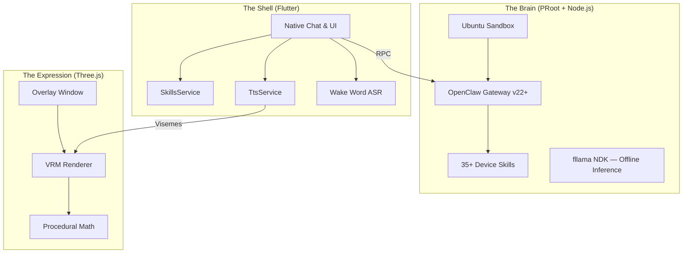
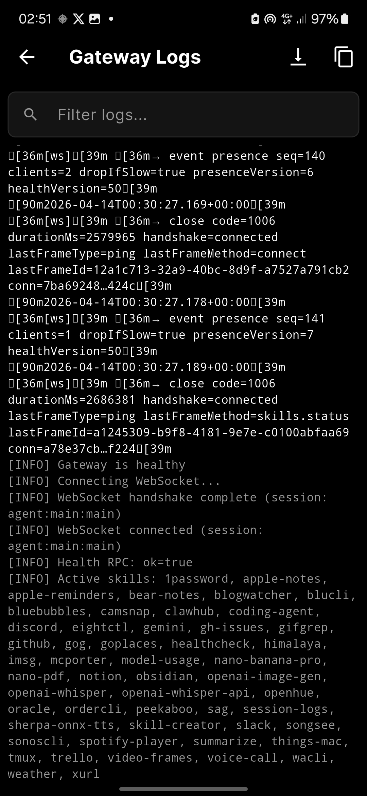

# Plawie — Your Pocket OpenClaw

  
  
   
  
  <h1>🌌 Plawie</h1>
  <h3>The World's Most Powerful Autonomous Agent Experience for Android</h3>
  
  **The full OpenClaw Agentic Experience — fully local, in your pocket.**  
  **No cloud. No compromises. Just pure intelligence.**

   

  
  
  
  

---

## ✨ What Makes Plawie Special

- **🤖 Fully Local LLM + Gateway** — Runs in a sandboxed PRoot Ubuntu environment with GPU acceleration.
- **🎭 Immersive VRM Avatar** — 3D digital companion with procedural gestures and perfect lip-sync.
- **🖼️ Hologram Presenter** — Beautiful floating overlays for canvas, images, web previews, and media.
- **🎙️ Voice-First Intelligence** — Continuous listening, wake word, and multiple offline TTS engines.
- **📱 Native Device Skills** — 35+ tools including Camera, Location, Haptics, Sensors, and Terminal Shell.
- **🔗 Web3 Ready** — On-chain actions, MoonPay integration, and native Solana wallet support.
- **🖥️ Professional Web Dashboard** — Full gateway control from any desktop browser on your network.

---

## 📱 The Experience

Plawie isn't just an app; it's a living digital entity. It combines industrial-grade Linux automation with a premium, glassmorphic user interface.

  <table>
    <tr>
      <td width="33%"> <b>Immersive Chat</b></td>
      <td width="33%"> <b>Real-time Dashboard</b></td>
      <td width="33%"> <b>VRM Companion</b></td>
    </tr>
    <tr>
      <td width="33%"> <b>35+ Native Skills</b></td>
      <td width="33%"> <b>Offline Inference</b></td>
      <td width="33%"> <b>Multi-Agent Fleet</b></td>
    </tr>
  </table>

---

## 🚀 Quick Start

1. **Download** the latest APK from [Releases](https://github.com/vmbbz/plawie/releases/latest).
2. **Install** on any device running Android 10+.
3. **Launch** → Plawie will automatically set up the hardened PRoot environment (**~40s setup**).
4. **Start Chatting** with your personal AI companion.

> **Pro Tip:** After first launch, go to **Agent Skills → Tools** and tap **Reset** to enable all hardware capabilities.

---

## 🧠 Industrial-Grade Mobile Architecture

Plawie represents a top 1% engineering achievement: a full **Ubuntu + Node.js OpenClaw environment** running entirely within a sandboxed **PRoot** layer directly on your phone.

### 🛡️ Production Reliability
- **Hardened Bootstrap (Instant-Install)**: Setup reduced from 15 minutes to **under 40 seconds** using pre-bundled assets and parallel multi-threaded downloading.
- **Proactive Self-Healing**: An intelligent watchdog monitor triggers a surgical "Auto-Repair" sequence in under 3 seconds if dependencies are missing.
- **Ephemeral Build Tools**: Heavy compilers (`g++`, `python3`) are installed only when needed and purged immediately, saving over **800 MB** of disk space.
- **Sticky Foreground Services**: The OpenClaw engine survives app closures and background pruning, ensuring 24/7 autonomous operation.

---

## 🏗️ Technical Deep Dive

```mermaid
graph TD
    subgraph "The Shell (Flutter)"
        A[Native Chat & UI] --> B[SkillsService]
        A --> D[TtsService]
        A --> W[Wake Word ASR]
    end

    subgraph "The Brain (PRoot + Node.js)"
        E[Ubuntu Sandbox] --> F[OpenClaw Gateway v22+]
        F --> G[35+ Device Skills]
        L[fllama NDK — Offline Inference]
    end

    subgraph "The Expression (Three.js)"
        H[Overlay Window] --> I[VRM Renderer]
        I --> J[Procedural Math]
    end

    A -- "RPC" --> F
    D -- "Visemes" --> I
```

### ⚡ Technology Stack
- **The Gateway:** PRoot + Ubuntu ARM64 + Node.js v22+.
- **The Local LLM:** [fllama](https://github.com/Telosnex/fllama) — Native ARM64 `.so` via NDK.
- **The Web3 Layer:** Native `solana` Dart SDK + Jupiter Ultra API.
- **The Expression:** WebGL bone-tracking renderer (Three.js).

---

## 📄 License
This project is licensed under the **MIT License**. Distributed as-is for educational and experimental automation purposes.

  
   
  <strong>Made with ❤️ for the OpenClaw community</strong> 
  <em>Plawie — Your AI Agent. Your Rules. Your Reality.</em>

