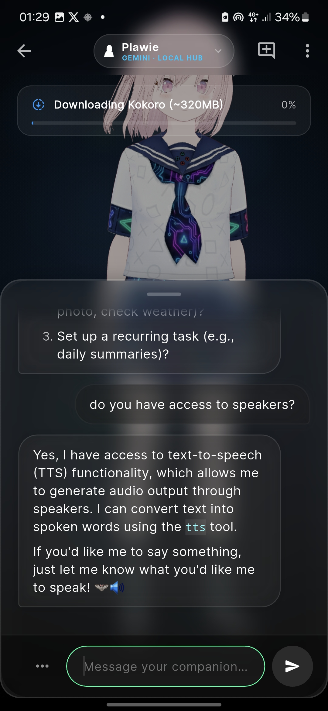
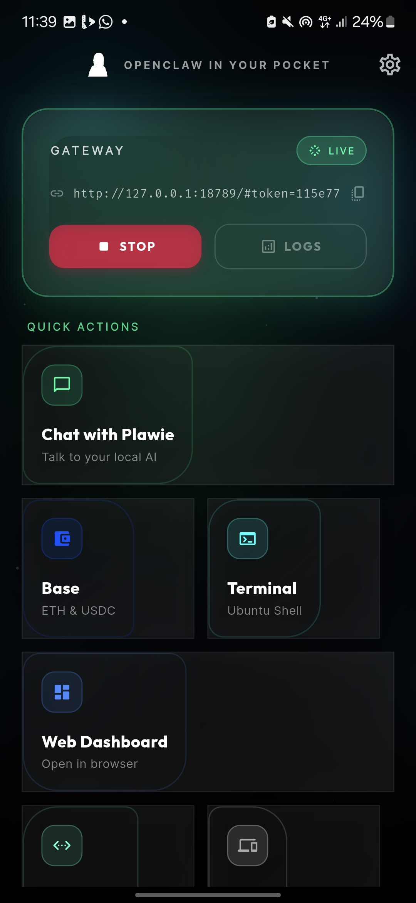
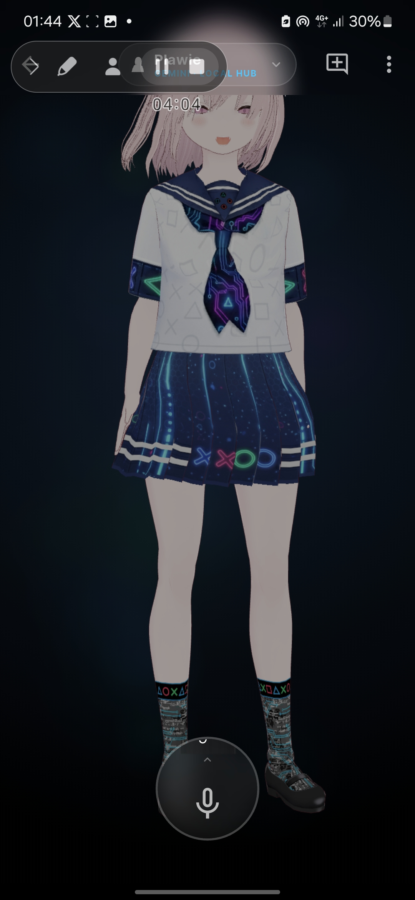
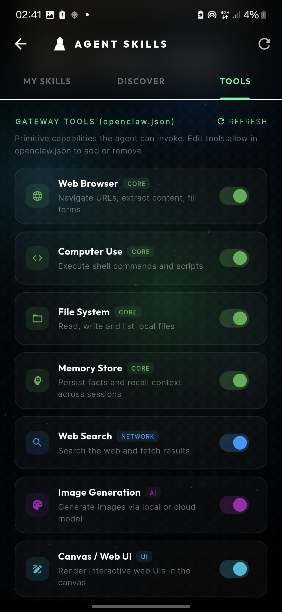
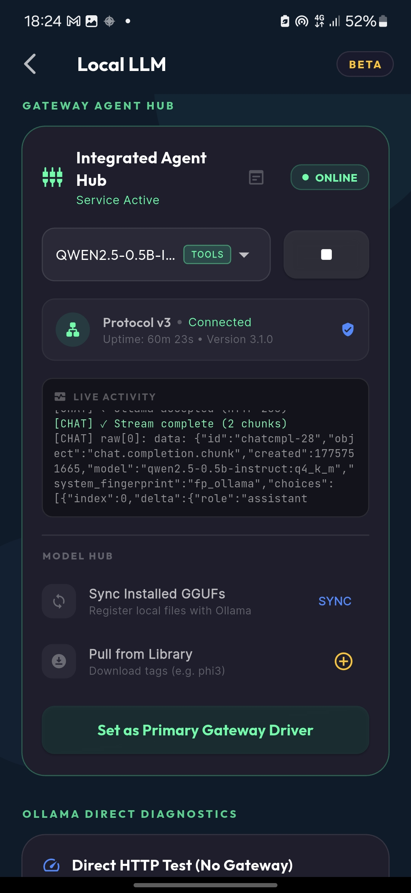
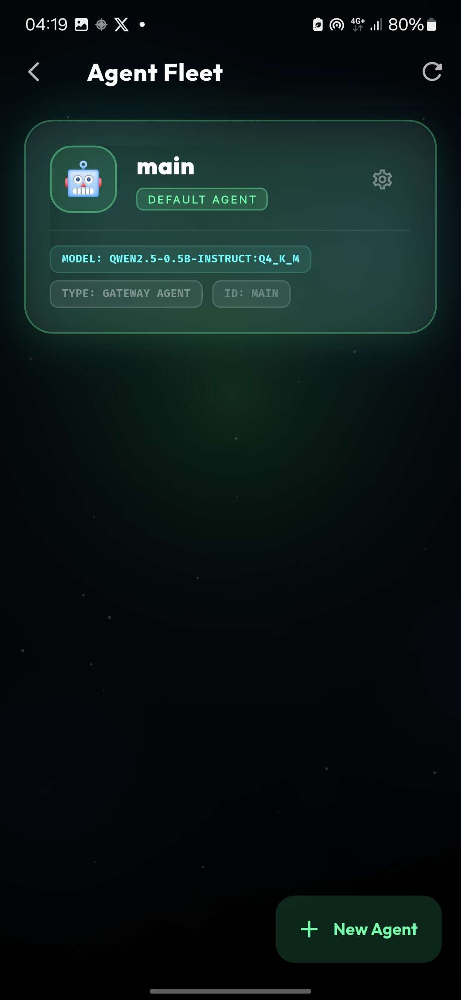
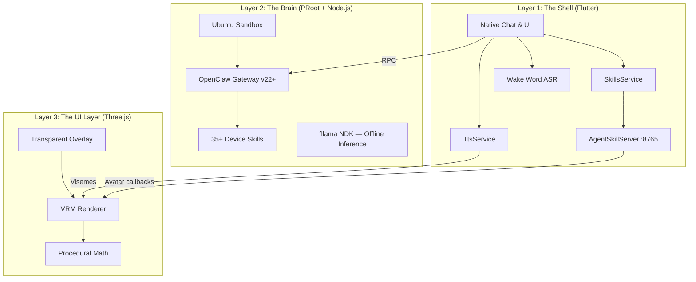

# Plawie — Your Pocket OpenClaw

  
  
   
  
  <h1>🌌 Plawie</h1>
  <h3>The World's Most Powerful Autonomous Agent Experience for Android</h3>
  
  **The full OpenClaw Agentic Experience — fully local, in your pocket.**  
  **No cloud. No compromises. Just pure intelligence.**

   

  
  
  
  

---

## ✨ What Makes Plawie Special

- **🤖 Fully Local LLM + Gateway** — Runs in a sandboxed PRoot Ubuntu environment with GPU acceleration.
- **🎭 Immersive VRM Avatar** — 3D digital companion with procedural gestures and perfect lip-sync.
- **🖼️ Hologram Presenter** — Beautiful floating overlays for canvas, images, web previews, and media.
- **🎙️ Voice-First Intelligence** — Continuous listening, wake word, and multiple offline TTS engines.
- **📱 Native Device Skills** — 35+ tools including Camera, Location, Haptics, Sensors, and Terminal Shell.
- **🔗 Web3 Ready** — On-chain actions, MoonPay integration, and native Solana wallet support.
- **🖥️ Professional Web Dashboard** — Full gateway control from any desktop browser on your network.

---

## 📱 The Experience

Plawie isn't just an app; it's a living digital entity. It combines industrial-grade Linux automation with a premium, glassmorphic user interface.

  <table>
    <tr>
      <td width="33%"> <b>Immersive Chat</b></td>
      <td width="33%"> <b>Real-time Dashboard</b></td>
      <td width="33%"> <b>VRM Companion</b></td>
    </tr>
    <tr>
      <td width="33%"> <b>35+ Native Skills</b></td>
      <td width="33%"> <b>Offline Inference</b></td>
      <td width="33%"> <b>Multi-Agent Fleet</b></td>
    </tr>
  </table>

---

## 🚀 Quick Start

1. **Download** the latest APK from [Releases](https://github.com/vmbbz/plawie/releases/latest).
2. **Install** on any device running Android 10+.
3. **Launch** → Plawie will automatically set up the hardened PRoot environment (**~40s setup**).
4. **Start Chatting** with your personal AI companion.

> **Pro Tip:** After first launch, go to **Agent Skills → Tools** and tap **Reset** to enable all hardware capabilities.

---

## 🧠 Industrial-Grade Mobile Architecture

Plawie represents a top 1% engineering achievement: we successfully embedded a full **Ubuntu + Node.js OpenClaw execution environment** running entirely within a sandboxed **PRoot** layer directly on your Android phone.

### 1. The Autonomous PRoot Gateway
We run a complete local Unix environment inside Android using PRoot. Inside this sandbox operates our highly optimized Node.js OpenClaw gateway. This gateway manages model switching, context windows, and complex tool-calling natively on your Snapdragon processor. It handles 35+ local Android skills to bridge the gap between intelligence and device-level actions.

### 2. Industrial-Grade Background Stability
Plawie is built for 24/7 autonomous operation. Unlike standard apps that die when you swipe them away:
- **Sticky Foreground Services**: The OpenClaw engine runs as a high-priority Android service, surviving app closures and background pruning.
- **Proactive Self-Healing**: An intelligent watchdog monitor triggers a surgical "Auto-Repair" sequence in under 3 seconds if dependencies are missing.
- **Hardened Bootstrap (Instant-Install)**: Setup reduced from 15 minutes to **under 40 seconds** using pre-bundled assets and parallel multi-threaded downloading.
- **Ephemeral Build Tools**: Heavy compilers (`g++`, `python3`) are installed only when needed and purged immediately, saving over **800 MB** of disk space.
- **Boot Persistence**: If enabled, Plawie automatically revives your gateway and node processes the moment your phone restarts and unlocks.

### 3. Native Solana Web3 Logic
Plawie is your ultimate Web3 co-pilot. We built a robust, fully native Solana integration directly into the app:
- **Real Ed25519 Keypairs:** Generated and secured in on-device storage.
- **DeFi Ready:** Swap tokens, set limit orders, and DCA via direct Jupiter API integration.
- **Zero Cloud Intermediaries:** Your private keys never touch a server; transactions are constructed and signed locally.

---

## 🎙️ Voice & Vision Intelligence

### Voice-First Intelligence Pipeline
Plawie ships a complete, multi-engine voice stack that puts you in full control — no cloud dependency required:
- **4 TTS Engines** — Piper (offline), Android Native TTS, ElevenLabs, or OpenAI TTS.
- **Continuous Mode** — After TTS finishes speaking, the mic automatically restarts.
- **Wake Word "Plawie"** — say *"Plawie"* to activate the mic from anywhere, entirely offline using the Vosk ASR engine.

### Video Vision AI
Your agent can see the world around you:
- **📷 Photo** — Attach any camera snapshot to a message; routed to local multimodal LLM or cloud Gemini.
- **📹 Video Clips** — Record 2–30s clips, extract key frames via PRoot `ffmpeg`, analyse each frame with the local vision model, then produce a coherent summary — 100% offline.

---

## 🎭 The UI Layer: An Airi-Style Experience

Plawie isn't just text; it's a living digital entity on your home screen.

### 🌌 Transparent Glassmorphic Overlay
Break free from the confines of the app. Plawie utilizes a custom system alert window to project your 3D companion as a transparent, floating overlay.

### 👁️ Procedural Realism & Ambience
Our WebGL-based VRM avatars are driven by a custom mathematical engine:
- **Ambient World Engine:** Procedural wind physics injected into VRM spring bones.
- **Saccadic Gaze & Breath:** Independent neck and eye-tracking using sum-of-sines algorithms.
- **Seamless Lip-Sync:** A highly optimized bidirectional bridge between the Flutter TTS isolate and the Three.js WebGL renderer.

---

## 🛠️ Agent Skills System: Three-Layer Architecture

| Concept | What it is | Where it lives |
|---------|-----------|----------------|
| **Skills** | npm packages for new *capabilities* (weather, GitHub, coding-agent…) | `~/.openclaw/node_modules/@openclaw/` |
| **Tools** | OS-level primitives the agent is *permitted to invoke* (browser, files, search…). | `openclaw.json → tools.allow[]` |
| **Custom App Skills** | Flutter-native skills wired directly into Android (avatar, device hardware) | `AgentSkillServer` on `127.0.0.1:8765` |

### Custom App Skills (Device-Native)
- **🎭 `avatar-control`** — Control the live VRM companion (gestures, emotions, models).
- **🔊 `tts-voice`** — Switch the speech engine or voice mid-conversation.
- **📱 `device-node`** — Direct hardware access: camera, vibration, flashlight, sensors.

---

## 🏗️ Technical Architecture

```mermaid
graph TD
    subgraph "Layer 1: The Shell (Flutter)"
        A[Native Chat & UI] --> B[SkillsService]
        A --> D[TtsService]
        A --> W[Wake Word ASR]
        B --> K[AgentSkillServer :8765]
    end

    subgraph "Layer 2: The Brain (PRoot + Node.js)"
        E[Ubuntu Sandbox] --> F[OpenClaw Gateway v22+]
        F --> G[35+ Device Skills]
        L[fllama NDK — Offline Inference]
    end

    subgraph "Layer 3: The UI Layer (Three.js)"
        H[Transparent Overlay] --> I[VRM Renderer]
        I --> J[Procedural Math]
    end

    A -- "RPC" --> F
    D -- "Visemes" --> I
    K -- "Avatar callbacks" --> I
```

### ⚡ Technology Stack Summary
- **The Gateway:** PRoot + Ubuntu ARM64 + Node.js v22+.
- **The Local LLM:** [fllama](https://github.com/Telosnex/fllama) — llama.cpp native ARM64 `.so`.
- **The Voice:** Piper (offline) · Android TTS · ElevenLabs · OpenAI TTS.
- **The Web3 Layer:** Native `solana` Dart SDK + Jupiter Ultra API.

---

## 📦 Post-Installation: First Run

#### Mode A — OpenClaw Gateway Chat (Full Tools + Skills)
1. **Start Gateway** — tap **Start** on the home screen.
2. **Set Your API Key** — go to **Settings → API Provider**.
3. **Start Chatting** — full tool-use and skills are available immediately.

#### Mode B — Local NDK Chat (fllama, No Internet)
1. **Local LLM** → Download a model (e.g. Qwen2.5-1.5B).
2. **Select** the model as active.
3. **In Chat**, select the `local-llm/` model. Direct NDK streaming.

---

## 📄 License
This project is licensed under the **MIT License**. Distributed as-is for educational and experimental automation purposes.

   
  <strong>Made with ❤️ for the OpenClaw community</strong> 
  <em>Plawie — Your AI Agent. Your Rules. Your Reality.</em>

