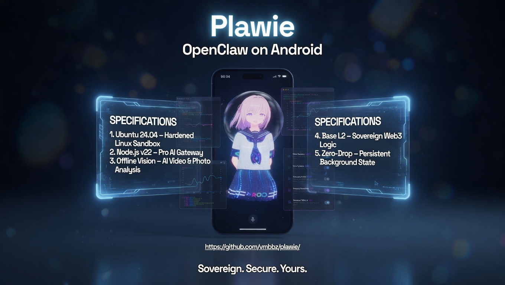

  

# Plawie v2.3.0 — "Human-Governed Mobile Agent"

> [!IMPORTANT]
> This release marks the transition of Plawie from an engineering prototype into a **hardened, production-ready autonomous agent platform**. We have focused on **Industrial-Grade Stability**, **Granular Security**, and a **World-Class User Experience**.

---

## 🛰️ The Next Evolution in mainstream OpenClaw adoption.
This release advances Plawie into a native-first OpenClaw control surface for Android. It combines the official, independently updated Gateway with dynamic model providers, visible skill readiness, wallet-funded inference, bridge receipts, and a human-governed KeeperHub Agent Execution Wallet.

---

## 🚀 Key Improvements

### 0. Unified Tools, Skills, Models, and Avatar Gestures
This v2.3.0 cut is the first release where the native Gateway lane, cloud and local models, Android skills, personal wallet, paid-provider flows, and KeeperHub execution proof work together as one governed mobile agent surface.
- **Shared model execution policy**: Cloud models keep the full Gateway context while local NDK/HTTP models receive compact tool-aware context suited to their limits.
- **Reliable tool invocation**: Phone tools now route through the Android node with explicit provider/model behavior and clearer unavailable-state handling.
- **Renderer-acknowledged gestures**: Avatar gestures now queue, start, complete, and report status through the VRM renderer instead of fire-and-forget callbacks.
- **Smooth VRMA playback**: Full-body and limb animations play in sequence without procedural motion fighting the authored files.

### 1. Granular "Pro" Storage Model (Play Store Compliant)
We have refactored our storage engine to move away from aggressive "All Files" requirements by default.
- **Sandboxed by Default**: Plawie now operates in a high-performance sandbox, ensuring privacy and compliance.
- **Pro Storage Opt-in**: Access **Settings > Storage & Files** to enable "All Files Access". This bind-mounts your phone's `/sdcard` directly into the PRoot Ubuntu environment for seamless model and file management.

### 2. Intelligent Auto-Repair Engine (Self-Healing)
No more silent failures or corrupted environments.
- **Proactive Watchdog**: A background monitor detects missing dependencies or stale configurations on startup.
- **Surgical Self-Healing**: If a configuration error is detected, Plawie automatically patches `openclaw.json` and `tools.allow` in under 3 seconds.

### 3. Hardened Bootstrap (Native-First Setup)
The bootstrap keeps the production Gateway on the embedded native Node runtime while retaining PRoot for explicit rollback and temporary package staging.
- **Pinned Core**: OpenClaw `2026.7.1` is installed reproducibly against Node `22.22.3`.
- **Safe Retries**: Stale npm launchers are removed before reinstall, and package version/entry-point integrity is verified afterward.
- **Remote Packs Last**: Signed dependency packs are downloaded only after the Gateway is healthy, and setup is not marked complete if a required pack fails.

### 4. Ephemeral Build Lifecycle (-800 MB Savings)
We've optimized the disk footprint to keep your phone lean.
- **JIT Compilers**: Heavy tools (`g++`, `python3`) are installed only when needed for native module compilation.
- **Automatic Purge**: Once the environment is optimized, all build tools and caches are surgically removed, saving nearly **1 GB** of storage.

---

## 🏗️ Technical Architecture

| Component | Status | Purpose |
| :--- | :---: | :--- |
| **Embedded Node.js v22.22.3** | `STABLE` | Native production Gateway engine |
| **PRoot Ubuntu 24.04** | `ROLLBACK` | Explicit compatibility and recovery path |
| **Foreground Service** | `PERSISTENT` | Zero-drop background execution |
| **Storage Bridge** | `OPT-IN` | Granular SAF /sdcard access |

---

## 📄 Installation & Migration
1. **Download**: Grab the `app-release.apk` from the GitHub Releases page.
2. **Launch**: Plawie will automatically detect your existing environment.
3. **Migrate**: The **Auto-Repair Engine** will automatically sanitize supported legacy configurations for v2.3.0 compatibility.

---

  <i>"Run OpenClaw fully local. Private, always-on, and under your absolute control."</i> 
  <b>Plawie — The World's Most Powerful Autonomous Agent Experience for Android.</b>

