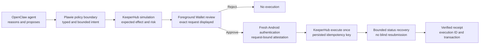
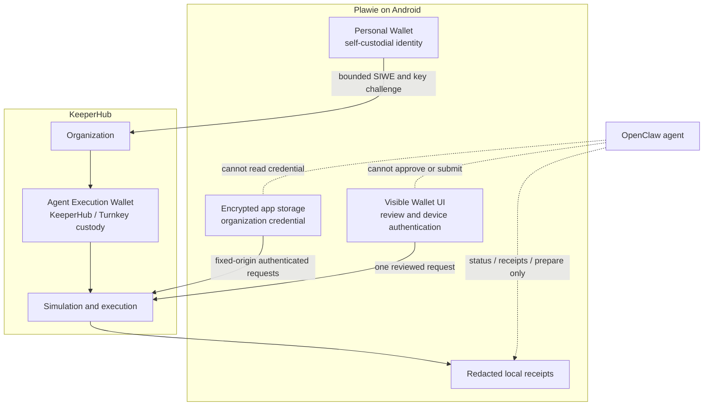
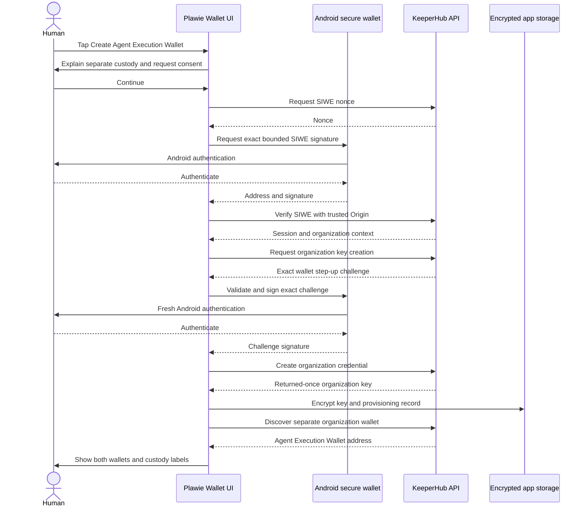
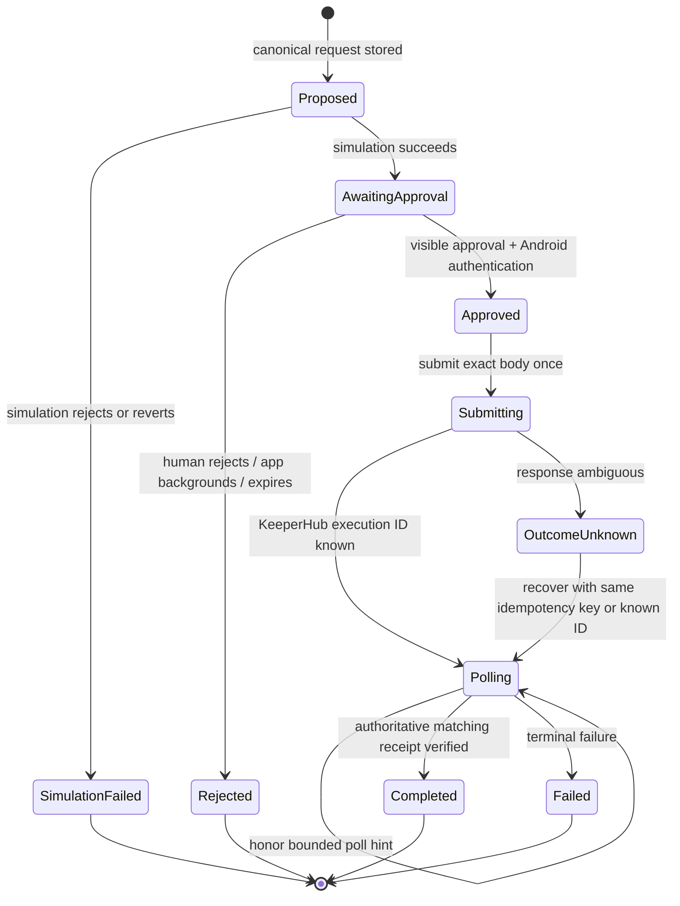

# The Agent Can Reason. The Phone Still Decides.

## Building a human-governed mobile Agent Wallet with Plawie, OpenClaw, KeeperHub, and Android

> **Publication status — 13 August 2026:** Evidence-backed draft. Physical-device
> KeeperHub onboarding, bounded review, Android authentication, and sponsored
> zero-value Base Mainnet execution are now proven with independently checked
> receipts. Terminal receipt persistence after process restart is also proven.
> An explicit pre-execution rejection is also recorded. A deliberately
> interrupted *in-flight* polling recovery and a deliberately failing
> simulation remain separate evidence tasks and are not claimed below.
>
> The agent-originated `keeperhub.prepare` path is now also proven on-device:
> it created an inert fourth proposal that remains at **Ready for human review**
> with no execution ID or transaction hash.

AI agents have become surprisingly good at deciding what should happen next.
They can research a market, inspect a task queue, prepare a transaction, and
explain a proposed action in plain language.

The harder problem begins after the decision.

An on-chain action must survive unreliable networks, process death, duplicate
retries, stale state, and ambiguous responses. It also needs an authority model
that does not quietly turn a helpful agent into an unattended hot wallet.

Plawie's answer is deliberately simple:

> **The agent proposes. KeeperHub executes reliably. The phone makes the human
> decision unavoidable.**

This is not an AI wallet that can spend whenever a model emits a tool call. It
is a native Android control surface that lets an agent prepare one bounded
intent, lets KeeperHub simulate and execute it, and requires the person holding
the device to inspect and authenticate the exact request before submission.

That distinction is the product.

---

## The thesis: autonomy needs a visible boundary

Plawie runs OpenClaw as a native-first Android application. The agent can use a
local Gateway, inspect skill readiness, and interact with device capabilities.
Wallet execution, however, crosses a different risk boundary. A persuasive
model response is not authorization.

The KeeperHub integration therefore separates four responsibilities:

| Layer | Responsibility | Explicitly cannot do |
|---|---|---|
| OpenClaw agent | Understand the request, explain it, inspect state, and prepare a bounded proof | Approve, authenticate, sign, submit, retry, revoke credentials, or move non-zero value |
| Plawie | Enforce policy, persist the immutable proposal, display the review, obtain fresh Android authentication, and retain receipts | Silently create an Agent Wallet or execute from background/chat |
| KeeperHub | Provision the organization wallet, simulate the transaction, execute with an idempotency key, expose status, and return receipts | Replace Plawie's human review contract |
| Human | Review network, wallet, recipient, value, reason, simulation, and expiry; then approve or reject | Be bypassed by an agent tool call |

KeeperHub describes itself as an execution and reliability layer between agent
intent and on-chain settlement. Its direct-execution flow supplies the pieces
Plawie needs for the last mile: simulation, idempotent submission, status
polling, and authoritative transaction receipts.

The flow remains human-governed even when the proposal originates in chat. The
agent can get the request to the review boundary; it cannot cross that boundary.

---

## Two wallets, two jobs

Plawie does not ask users to turn their personal wallet into an agent's
execution account.

The Wallet page presents two separate identities:

1. **Personal Wallet** — the user's self-custodial Plawie wallet. Its private
   key is protected by Android Keystore-backed application controls and is used
   for explicit, device-authenticated identity operations.
2. **Agent Execution Wallet** — a distinct KeeperHub organization wallet,
   managed through KeeperHub and Turnkey, intended for bounded execution and
   limited funding.

Plawie uses the product label **Agent Execution Wallet** because it explains
the wallet's job to a mobile user. Technically, the current integration is the
organization wallet created by KeeperHub's headless onboarding flow. It is not
the separate `@keeperhub/wallet` package described in KeeperHub's agentic-wallet
documentation.

That distinction matters. The first-party package has its own `auto`, `ask`,
and `block` safety hook. Plawie instead keeps approval in its native Android UI
and uses the organization credential only through a fixed-origin, allowlisted
REST client. We did not install a generic wallet SDK and hand its methods to the
model.

The execution wallet should be treated like an operational account: optional,
clearly labelled, minimally funded, and separate from the user's primary
assets. A compromised operational credential should never expose the Personal
Wallet.

---

## Onboarding without a copied API key

A serious mobile onboarding flow cannot require the user to visit a dashboard,
copy a long-lived secret, paste it into chat, and hope it never appears in a
log.

KeeperHub's headless onboarding API makes a better path possible. In Plawie,
the user explicitly taps **Create Agent Execution Wallet**. Nothing is created
during app startup, setup, chat, or card rendering.

The sequence is:

Several details are deliberately defensive:

- The KeeperHub origin and API paths are fixed and allowlisted.
- Redirects are rejected instead of followed across origins.
- SIWE cookies live only in the short-lived client instance; they are not
  persisted as application credentials.
- Session-cookie authentication and organization-key authentication cannot be
  mixed in one request.
- Android reconstructs and validates the exact SIWE and key-management
  challenge contract before signing.
- The returned-once organization credential is written to encrypted app
  storage and never placed in OpenClaw configuration, agent context, Gateway
  logs, receipts, or capability payloads.
- If remote wallet provisioning is still pending after the credential is
  issued, Plawie retains an honest recoverable state instead of losing or
  recreating the credential.

Revocation follows the same philosophy. It needs fresh device authentication,
targets the stored organization key ID, and clears the local secret only after
KeeperHub confirms revocation or confirms that the key is already unavailable.
An ambiguous network result becomes `revocationUnknown`; the app keeps the
encrypted credential so the person can safely retry rather than pretending the
remote capability has disappeared.

---

## The agent gets a capability, not a wallet API

The easiest integration would have been to expose KeeperHub's generic execution
surface to OpenClaw. It would also have been the wrong integration.

Plawie exposes four bounded capability commands:

| Command | What it returns or changes |
|---|---|
| `keeperhub.capabilities` | Declares custody, proof network, amount, and every denied authority |
| `keeperhub.status` | Reads redacted connection state and any active execution |
| `keeperhub.receipts` | Reads at most 20 redacted local receipts without credentials or signatures |
| `keeperhub.prepare` | Simulates and persists one zero-value Base Mainnet self-transfer proposal |

`keeperhub.prepare` does **not** open an approval sheet and does **not** submit a
transaction. It returns the next human action: open **Wallet → Agent Execution
Wallet**, then review or discard the prepared proof.

The current proof contract is intentionally narrow:

- network: Base Mainnet;
- chain ID: `8453`;
- asset and amount: `0 ETH`;
- sender and recipient: the same Agent Execution Wallet;
- objective: bounded plain text;
- no arbitrary contract call;
- no generic workflow execution;
- exactly zero transferred value.

This produces a useful first proof without pretending that arbitrary autonomous
spending is production-ready. Plawie deliberately keeps the same zero-value,
self-transfer-only proof while running it on Base Mainnet. KeeperHub supports
Base (`8453`) for direct execution and gas sponsorship, though sponsorship
depends on organization settings and available gas credits.

---

## Simulation is useful only if approval is bound to it

Showing a simulation and later submitting a different request is security
theatre. Plawie persists the canonical proof body and derives a stable
idempotency identity from the immutable work fields. The review and Android
attestation are bound to that exact stored request.

The foreground review displays:

- custody and source wallet;
- network and chain ID;
- recipient;
- value;
- human-readable objective;
- simulation outcome;
- request expiry;
- the fact that KeeperHub, not the Personal Wallet, manages the execution key.

The approval broker is one-use and foreground-only. If there is no visible
review host, the request fails closed. If the app backgrounds, the pending
decision is cancelled. KeeperHub reviews and paid-provider payment approvals
share one exclusive, screen-capture-protected surface so two consequential
dialogs cannot overlap or clear each other's secure state.

After the user taps approve, Android asks for fresh authentication and validates
the exact bounded execution fields again. Only then may the coordinator submit
the persisted request.

The Android attestation is an important local control, but we should be precise
about its current limit: KeeperHub does not cryptographically require that
device attestation as an on-chain co-signature. If the organization bearer
credential were stolen outside Plawie, the app's review screen could be
bypassed. That is why the current Agent Execution Wallet remains optional,
separate, and suitable only for tightly limited funds.

The production end state is stronger: a multi-owner Safe in which KeeperHub is
an execution signer and a Plawie-controlled device authority is another owner,
with a threshold above one plus contract/function allowlists and token spending
caps. KeeperHub's current Safe documentation describes a Turnkey EOA as sole
owner with threshold one and optional Zodiac restrictions. In that model, a
compromised sole owner can bypass module restrictions. Multi-owner,
device-co-signed enforcement is therefore a future protocol collaboration, not
something this article claims is already implemented.

---

## Reliability means surviving uncertainty

Mobile execution cannot assume the process stays alive between “submit” and
“confirmed.” A user can switch apps, lose connectivity, kill the process, or
walk into a tunnel after the network accepts the transaction but before the
client receives the response.

A naive retry can submit twice.

Plawie handles that uncertainty as persisted state:

Before submission, Plawie persists the canonical body and idempotency key. A
network ambiguity does not trigger a newly constructed transaction. Recovery
replays the same work identity or polls the existing KeeperHub execution ID.
The coordinator honors KeeperHub's polling hint within bounded limits.

Completion is not inferred from a transaction URL or a self-reported hash.
Plawie requires exactly one authoritative KeeperHub receipt whose transaction
hash matches the execution status, whose chain is Base Mainnet, whose receipt
status is successful, and whose verification timestamp is present. A mismatch
becomes `receipt_not_verified`, not a green success card.

The remaining live reliability stress test is to kill the app while it is
polling, reopen it, and show that the same execution is recovered without a
duplicate transaction. The state machine and automated failure coverage exist,
but this article does not present them as physical-device evidence yet.

---

## Live Base Mainnet evidence — 13 August 2026

The first physical-device proof followed the production path rather than a
test-only shortcut:

1. KeeperHub simulated an exact `0 ETH` transfer on Base Mainnet (`8453`) from
   the Agent Execution Wallet back to itself.
2. Plawie displayed the full review in the foreground and did not expose an
   agent-accessible approval or submission command.
3. The user continued to Android authentication on the physical device.
4. KeeperHub accepted one persisted intent and sponsored its gas.
5. Plawie polled the execution, required an authoritative matching receipt,
   and rendered **Verified on-chain**.
6. A public Base RPC independently returned receipt status `0x1` for the same
   hash and block.
7. Plawie was force-stopped and relaunched after completion. The same single
   terminal receipt reappeared without an active request or resubmission.

| Evidence field | Canonical proof |
|---|---|
| Network | Base Mainnet (`8453`) |
| Intent | `kh_99dc92c349164d77b5895bdaf195117e` |
| KeeperHub execution | `59ja3y71gxctnet4zprd8` |
| Amount | `0 ETH` |
| Simulation | success; would not revert; estimate `21,000` gas |
| Sponsorship | `true` |
| Idempotent replay | `false` |
| Transaction | [`0xdcf1a13c…73117b04`](https://basescan.org/tx/0xdcf1a13c3e83ded25c8104e5aa654ff300f381269a506a83b69fd9fd73117b04) |
| Base block | `49,896,836` |
| Verified receipt | success; `80,521` gas used |
| KeeperHub verification time | `2026-08-13T01:03:41.947Z` |

The public transaction is a sponsored delegated execution envelope. Its outer
transaction sender and target belong to KeeperHub's execution infrastructure;
the bounded Agent Wallet self-transfer is encoded in the transaction call. The
chain proves that the envelope succeeded with zero native value, while
KeeperHub's re-fetched authoritative receipt binds that settlement to the
stored execution. This distinction avoids presenting an infrastructure
transaction as a plain EOA transfer.

A second proof was later simulated and separately authorized by the user. It
produced a distinct intent, execution ID, and verified transaction
(`0x9ce5e377…d6def2a9`) with `idempotentReplay: false`. That is expected new
work—not a retry or duplicate of the canonical proof. Each approved intent has
exactly one successful receipt.

A third proposal was simulated only to exercise the negative boundary. It was
explicitly discarded from the foreground Wallet UI before Android
authentication. Plawie persisted **Rejected before execution**, and no third
transaction appeared.

A fourth proposal was prepared through the real agent-facing
`keeperhub.prepare` capability. It remains `awaitingApproval`; the Wallet shows
**Ready for human review** and exposes only **Review & authorize** or
**Discard**. No execution ID or transaction hash exists for it.

The model's narration after that tool call initially returned `403 A foreground
user turn is required for this provider.` This was a Venice continuation issue,
not a KeeperHub rejection. Code-path analysis identified Android's
biometric/system authentication overlay as the source of a transient
`inactive` lifecycle state that erased the bounded paid-provider turn lease.
Plawie now preserves the inert lease across only that obscured state while
continuing to erase it on true background states. Thirty focused paid-provider
tests pass, including lifecycle, cancellation, one-payment-per-message,
mismatch, uncertainty, and no-replay cases.

This run did **not** interrupt the app between broadcast and final receipt. It
therefore proves completed-receipt persistence, but not the stronger in-flight
reconciliation scenario. We keep that claim gated rather than manufacture a
third Mainnet transaction solely for demonstration.

---

## What exists today, and what still needs proof

The implementation is substantial, but a credible technical story must
separate code-complete controls from evidence-complete behavior.

| Capability | Current status on 13 August 2026 |
|---|---|
| Fixed-origin KeeperHub REST client and strict request handling | Implemented |
| Explicit headless SIWE onboarding and organization-key step-up | Implemented |
| Secure returned-once credential storage and restart recovery | Implemented |
| Separate Personal and Agent Execution Wallet UI | Implemented |
| Bounded agent status, receipt, and proof-preparation commands | Implemented |
| Physical-device agent-originated inert proposal | Proven; awaiting human review with no execution ID/hash |
| Zero-value Base Mainnet self-transfer policy | Implemented |
| Simulation, immutable request binding, one-use approval, and Android authentication | Implemented |
| Persisted idempotency, bounded polling, restart recovery, and verified receipt checks | Implemented |
| Device-authenticated remote organization-key revocation | Implemented |
| Physical-device KeeperHub account and organization acceptance | Proven on the connected Android device |
| Live reject/cancel with no execution | Proven; physical-device rejection capture above |
| Deliberately failing simulation recording | **Still required** |
| Real zero-value Base Mainnet transaction and verified receipt | Proven; canonical explorer hash above |
| Completed receipt persistence after process restart | Proven; same receipt restored without resubmission |
| Deliberately interrupted in-flight polling recovery | **Still required** |
| Non-zero KeeperHub transfer | Deliberately blocked and out of scope |
| Paid x402 marketplace workflow through KeeperHub | Stretch; not implemented |
| Multi-owner Safe with on-chain device co-approval | Production direction; not implemented |

The repository contains focused Flutter and Android policy tests
covering such cases as missing foreground UI, cancellation, immutable request
binding, tampered local state, unexpected redirects, mismatched receipts,
ambiguous submission, status-only recovery, unexpected KeeperHub challenges,
and uncertain remote revocation.

On 12 August, the Base Mainnet migration subset completed with 26 focused
Flutter tests and all five Android KeeperHub message-policy tests passing. The
arm64 debug APK also compiled the native policy and passed the artifact secret
audit. On 13 August, the physical-device Mainnet proof passed and its receipt
was independently reconciled through a public Base RPC. The final evidence
round then passed all 41 KeeperHub Flutter tests and the five Android-native
message-policy tests with zero failures. A separate 30-test paid-provider
lifecycle suite also passed after the transient biometric continuation fix.
The in-flight interruption case remains the outstanding reliability evidence
gate; automated tests are not presented as a substitute for that live
scenario.

---

## The demo that proves the thesis

A winning demo should show controls under stress, not only a transaction that
works on the first attempt.

### Act 1 — Establish separate authority

1. Open Plawie's Wallet page and show the Personal Wallet.
2. Tap **Create Agent Execution Wallet**.
3. Show the custody disclosure and explicit consent.
4. Complete the two Android-authenticated signing moments.
5. Show the Personal Wallet and the distinct KeeperHub-managed Agent Execution
   Wallet side by side.

### Act 2 — Show that the agent cannot spend

1. Ask the OpenClaw agent what KeeperHub can do.
2. Display the capability response with `approve`, `sign`, `submit`, `retry`,
   and `moveNonZeroValue` all denied.
3. Ask the agent to prepare the proof.
4. Show that chat reports an inert proposal and directs the user to Wallet.
5. Demonstrate a cancellation: open review, reject it, and prove there is no
   execution.

### Act 3 — Prove safe execution and recovery

1. Prepare a fresh zero-value Base Mainnet proof.
2. Show the exact successful simulation.
3. Approve visibly and complete fresh Android authentication.
4. Interrupt the app or network during polling.
5. Reopen Plawie.
6. Show recovery of the same KeeperHub execution ID.
7. Show one verified receipt and one explorer transaction—never two.

### Act 4 — Explain the honest boundary

End by showing the two-wallet architecture and stating the limitation directly:
the current local human gate is strong, but the long-term target is a
multi-owner Safe where device approval is also an on-chain threshold condition.
Security honesty is more memorable than pretending the risk has vanished.

---

## Why this belongs in Plawie

This integration is not a KeeperHub logo placed beside an API request.

- It turns the phone into a consequential-action boundary for an OpenClaw
  agent.
- It uses KeeperHub's execution semantics where they matter most: simulation,
  idempotency, recovery, and verified receipts.
- It improves onboarding by creating the user, organization credential, and
  managed wallet through explicit in-app SIWE instead of copied secrets.
- It demonstrates a native Android agent experience rather than a terminal
  wrapper.
- It gives the agent useful wallet awareness without giving it signing
  authority.
- It makes failure, cancellation, custody, and recovery visible to ordinary
  users.

The result is a practical answer to the question every agent-wallet product
eventually faces: **when software can act, where does human authority live?**

In Plawie, it lives in a visible, authenticated moment on the device in the
user's hand.

---

## Publication media checklist

Use real device captures only. Do not mock transaction evidence.

1. **Wallet identities:** Personal Wallet and Agent Execution Wallet cards in
   one frame. Shorten addresses in the UI; do not expose secrets or full logs.
2. **Consent:** “Create Agent Execution Wallet?” disclosure before SIWE.
3. **Onboarding:** safe progress state without a credential, cookie, or
   signature visible.
4. **Bounded agent:** chat response showing the four allowed KeeperHub commands
   and denied execution authority.
5. **Review:** the zero-value Base Mainnet approval sheet showing wallet,
   recipient, amount, reason, simulation, and expiry.
6. **Cancellation:** rejected proof with no transaction.
7. **Recovery:** polling or `outcomeUnknown`, followed by the same execution
   recovered after reopening.
8. **Receipt:** verified transaction card plus independently opened Base
   Mainnet explorer page. This is mandatory before describing the workflow as
   executed.
9. **Architecture visual:** export the two Mermaid diagrams above as crisp SVG
   assets for the article and social thread.

Recommended redactions: organization key ID beyond its short prefix, request
headers, signatures, cookies, full device identifiers, and any unrelated wallet
balances.

---

## Suggested social launch

### Single-post version

> We built Plawie around one rule: the agent can propose an on-chain action, but
> the phone still decides. OpenClaw prepares a bounded intent, KeeperHub
> simulates and executes it, and Android forces visible review plus fresh human
> authentication. Our first sponsored Base Mainnet proof is now independently
> verifiable on-chain. [article link]

### Five-post thread

1. AI agents are good at deciding. The dangerous part is execution under real
   network and process failure. We built Plawie to make that boundary visible.
2. There are two wallets: an Android-protected Personal Wallet for identity and
   a separately custodial, minimally funded KeeperHub Agent Execution Wallet.
3. The OpenClaw agent can inspect, read redacted receipts, and prepare one
   zero-value Base Mainnet proof. It cannot approve, authenticate, sign, submit,
   retry, revoke credentials, or move non-zero value.
4. KeeperHub provides simulation, idempotent execution, status recovery, and
   verified receipts. Plawie binds those to a foreground review and fresh
   Android authentication.
5. The first sponsored Base Mainnet proof now has a successful, independently
   checked receipt. Completed-receipt restart persistence passed; deliberate
   in-flight recovery remains the next recorded stress test. [video] [article]

---

## Primary references

- [KeeperHub overview](https://docs.keeperhub.com/intro/overview)
- [KeeperHub headless onboarding](https://docs.keeperhub.com/api/headless-onboarding)
- [KeeperHub direct execution](https://docs.keeperhub.com/api/direct-execution)
- [KeeperHub API keys](https://docs.keeperhub.com/api/api-keys)
- [KeeperHub Safe model](https://docs.keeperhub.com/wallet-management/safe)
- [KeeperHub agentic wallet](https://docs.keeperhub.com/ai-tools/agentic-wallet)
- [KeeperHub workflow marketplace](https://docs.keeperhub.com/workflows/marketplace)
- [Agents Onchain hackathon](https://dorahacks.io/hackathon/agents-onchain)
