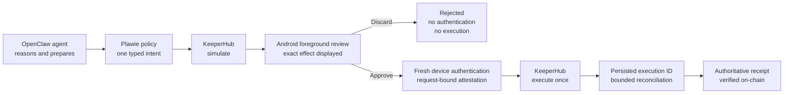
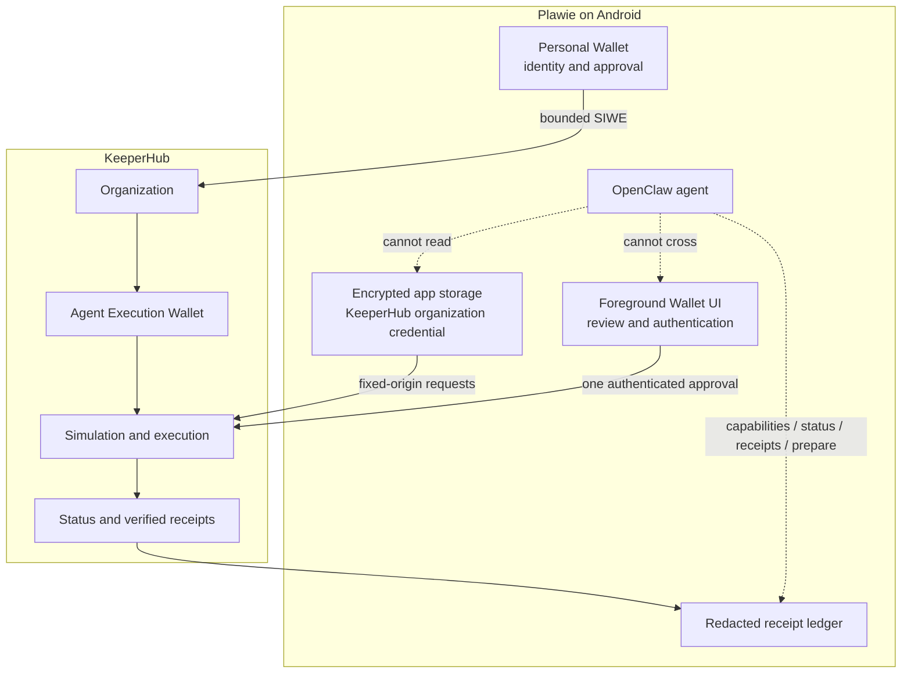
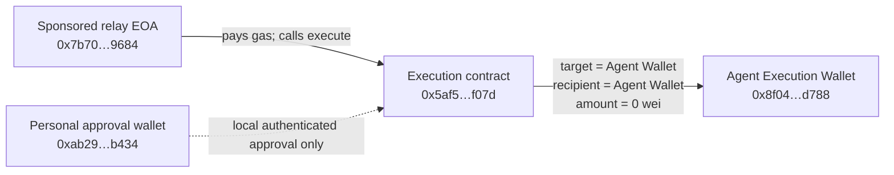
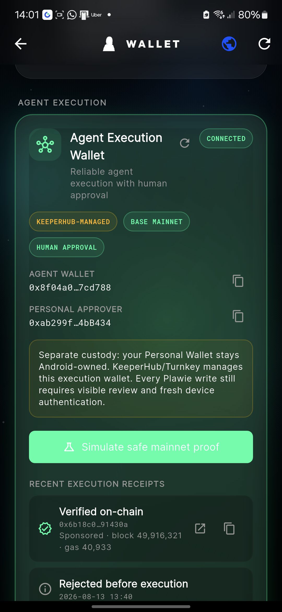
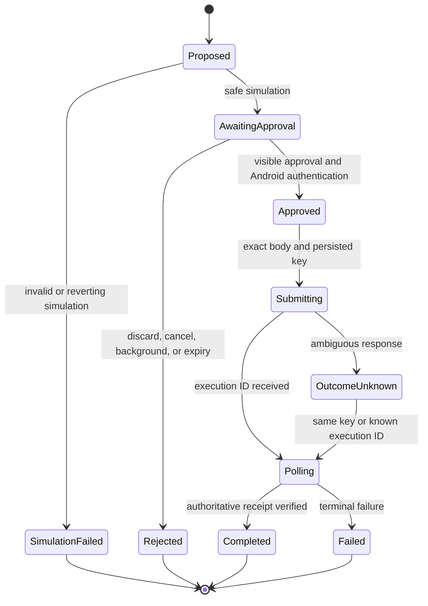

# Plawie — Human-Governed Agent Wallet

> **KeeperHub Agents Onchain submission dossier · 13 August 2026**
> **Track thesis:** The agent proposes. KeeperHub executes reliably. The phone
> makes the human decision unavoidable.

| Submission field | Value |
|---|---|
| Project | **Plawie — Human-Governed Agent Wallet** |
| Product | Native-first OpenClaw Gateway and companion for Android |
| Website | <https://plawie.app> |
| Source | <https://github.com/vmbbz/plawie/tree/codex/hybrid-bridge-funding-design> |
| Canonical KeeperHub transaction | [Agent-originated Base Mainnet `0x6b18c0e5…991430a`](https://basescan.org/tx/0x6b18c0e5475a97996f5a9654392050bf7cc754aa1b31c6f2492645750991430a) |
| Supporting KeeperHub transactions | [Base Mainnet `0xdcf1a13c…73117b04`](https://basescan.org/tx/0xdcf1a13c3e83ded25c8104e5aa654ff300f381269a506a83b69fd9fd73117b04), [`0x9ce5e377…d6def2a9`](https://basescan.org/tx/0x9ce5e37757383b1bd28232bd3a1d72e501671d5557a90aad1ddaca8ed6def2a9), and latest A3 [`0x249fcef5…0cad58`](https://basescan.org/tx/0x249fcef5bf20ebc598f105ee2d6efbc11893fea70eeca7c07b0694f4f80cad58) |
| Demo video | [Plawie — Human-Governed Agent Wallet](https://youtu.be/jcZN3e34LVs) |
| Video edit handoff | [Asset and edit manifest](KEEPERHUB_VIDEO_ASSET_MANIFEST.md) |
| Canonical machine-readable evidence | [`keeperhub-agent-proof-0x6b18c0e5.json`](evidence/keeperhub-agent-proof-0x6b18c0e5.json) |
| Latest A3 machine-readable evidence | [`keeperhub-a3-proof-0x249fcef5.json`](evidence/keeperhub-a3-proof-0x249fcef5.json) |
| Long-form technical article | [The Agent Can Reason. The Phone Still Decides.](../articles/2026-08-11-plawie-human-governed-keeperhub-agent-wallet.md) |
| Detailed evidence runbook | [Live evidence runbook](../HACKATHON_LIVE_EVIDENCE_RUNBOOK.md) |
| Evidence status | GLM-5 prepared the canonical proof through OpenClaw; the human reviewed and authenticated in Wallet; KeeperHub sponsored and verified it on Base Mainnet. Three supporting proofs and one pre-execution rejection are also recorded. |

> [!IMPORTANT]
> The transaction and product links above are ready. The source branch is
> pushed and was verified reachable from a signed-out request on 13 August
> 2026. The final demo video is public and linked from the DoraHacks BUIDL page.
> The signed-in hackathon event page remains the authority for any separate
> enrollment action, exact closing time, or changed bounty wording.

> [!NOTE]
> Android's protected authentication surface did not appear in the onboarding
> screen recording. We did not weaken that protection. The onboarding proof is
> instead the recorded custody disclosure and Connected transition, the
> persistent Agent Wallet address `0x8f04a0…7cd788`, and the later verified
> KeeperHub execution whose decoded target and recipient bind to that address.
> KeeperHub/Turnkey wallet provisioning is off-chain, so there is no expected
> “wallet creation transaction.”

---

## Executive summary

Plawie runs the full OpenClaw Gateway natively on Android. It gives a mobile AI
agent useful skills, device tools, model choice, wallets, and a persistent local
control surface without requiring a PC or hosted Gateway.

For on-chain action, Plawie introduces a deliberately different trust model:
the model may understand a request and prepare one tightly bounded intent, but
it cannot approve, authenticate, sign, submit, retry, revoke credentials, or
move non-zero value. KeeperHub supplies the execution and reliability layer:
headless organization-wallet provisioning, simulation, sponsored execution,
stable idempotency, status reconciliation, and authoritative receipts. Plawie
binds those capabilities to a visible foreground review and fresh Android
authentication.

The canonical live proof follows the complete product path recorded on a
physical Android device. GLM-5 invoked the real OpenClaw `keeperhub.prepare`
capability; KeeperHub simulated one bounded request; chat directed the user to
Wallet; the phone displayed the exact review; and only then did the human
authorize and authenticate. KeeperHub sponsored the resulting zero-value Base
Mainnet execution and returned an authoritative verified receipt.

The zero value is an intentional safety constraint, not a mocked transaction.
The canonical execution settled successfully in block `49,916,321`, and the
receipt persisted in Wallet. Three separately authorized supporting intents
provide independent supporting transactions. Another simulated proposal was
explicitly discarded before authentication and produced no transaction.

This is the product claim:

> **Plawie turns an Android phone into the human-governed execution boundary
> between an AI agent's intent and KeeperHub's on-chain reliability layer.**

---

## The problem

Agents are increasingly capable of reasoning about consequential actions. The
harder production problem begins after the model decides what should happen:

- a transaction can revert or land with a different outcome than a client
  assumes;
- an interrupted request can tempt a client into a duplicate submission;
- credentials can leak into model context, logs, or generic tool payloads;
- a persuasive model response is not meaningful user authorization;
- mobile processes and networks disappear at inconvenient times;
- wallet custody and approval authority are often blurred into one unsafe hot
  account.

Plawie addresses the boundary rather than pretending those failures disappear.

---

## Why KeeperHub is essential—not decorative

Plawie already had wallets and a native Android runtime. We did not add
KeeperHub merely to obtain a transaction link. KeeperHub owns the part of the
architecture it is designed to solve: reliable execution after agent intent.

| KeeperHub surface | How Plawie uses it | Why it matters |
|---|---|---|
| Headless onboarding | Android-authenticated SIWE establishes the user and provisions a separate organization execution wallet and credential | No dashboard visit or copied API key is required; the execution account is distinct from the personal wallet |
| Direct simulation | The exact zero-value transfer is simulated before a review can become actionable | The person reviews an effect KeeperHub says will not revert, not an untested model suggestion |
| Stable idempotency | Plawie persists one deterministic work key before submission and never rotates it while the outcome is ambiguous | A dropped response cannot justify broadcasting freshly reconstructed work |
| Sponsored direct execution | KeeperHub broadcasts the approved proof and sponsors gas | The proof is a real Base Mainnet execution without asking the user to fund an operational wallet with ETH |
| Execution status | Plawie retains the returned execution ID and polls with bounded timing | Mobile recovery is based on the original execution, not blind retry |
| Authoritative receipts | Plawie requires a matching re-fetched receipt with a successful status and verification timestamp | A transaction URL alone is not treated as success |
| Remote credential revocation | A separately authenticated flow revokes the organization key before local deletion | “Disconnect” is not a cosmetic local toggle |

This follows KeeperHub's current Direct Execution contract: simulate the same
body, send it once with a stable `Idempotency-Key`, retain the `executionId`,
poll status, and treat the returned receipts as authoritative on-chain proof.
KeeperHub scopes replay protection by organization and endpoint and documents a
24-hour replay window. Plawie therefore persists the key before submission,
keeps the transfer endpoint fixed, and never treats key rotation as recovery.

Plawie intentionally did **not** expose KeeperHub's generic write-capable MCP
catalog or organization bearer key to the model. The integration uses a narrow
app-owned REST client because a mobile approval surface is a security boundary,
not an agent tool.

---

## Two wallets, two authorities

| Wallet | Role | Custody | Agent access |
|---|---|---|---|
| Personal Wallet | User identity and Android-authenticated approval authority | Plawie self-custody, protected by Android platform controls | No private-key access; no autonomous signing |
| Agent Execution Wallet | Operational account for bounded KeeperHub execution | KeeperHub/Turnkey-managed organization wallet | Redacted status/receipts and proposal preparation only |

The current human gate is app-enforced. The long-term production target is a
multi-owner Safe in which device approval is also an on-chain threshold
condition. Until that integration is available and audited, the managed Agent
Execution Wallet remains optional, clearly labelled, minimally funded, and
separate from personal assets.

---

## Agent authority contract

The OpenClaw capability exports only four commands:

- `keeperhub.capabilities`
- `keeperhub.status`
- `keeperhub.receipts`
- `keeperhub.prepare`

The capability reports these effective permissions:

| Capability | Agent |
|---|---:|
| Read connection status | Allowed |
| Read redacted receipts | Allowed |
| Prepare one zero-value Base Mainnet proof | Allowed |
| Open the approval UI | Denied |
| Approve or authenticate | Denied |
| Sign or submit | Denied |
| Retry a write | Denied |
| Revoke credentials | Denied |
| Execute a generic workflow | Denied |
| Move non-zero value | Denied |

`keeperhub.prepare` calls the same production coordinator used by the Wallet
surface. It simulates and persists an inert proposal, then tells the user to
open **Wallet → Agent Execution Wallet**. Approval remains impossible through
chat, the Gateway, background lifecycle events, or an agent-generated payload.

---

## Live Base Mainnet proof

### Canonical execution

| Evidence field | Value |
|---|---|
| Network | Base Mainnet (`8453`) |
| Agent Execution Wallet | `0x8f04a0b7192b9da472d5a1b63d75ee61fa7cd788` |
| Personal approval wallet | `0xab299fea9D2884A4B0321af1B79E452E464bB434` |
| Agent/model path | OpenClaw `keeperhub.prepare` invoked by GLM-5 (`zai-org-glm-5-2`) |
| Intent | `kh_44dc23e5122a4d17895927032a5881e5` |
| KeeperHub execution | `ti85uqkad0hbnx57wi9p6` |
| Action | Exact `0 ETH` self-transfer |
| Simulation | Success; would not revert; estimate `21,227` gas |
| Sponsored | `true` |
| Idempotent replay | `false` |
| Transaction | [`0x6b18c0e5475a97996f5a9654392050bf7cc754aa1b31c6f2492645750991430a`](https://basescan.org/tx/0x6b18c0e5475a97996f5a9654392050bf7cc754aa1b31c6f2492645750991430a) |
| Block | `49,916,321` |
| Gas used | `40,933` |
| KeeperHub receipt | `success`, `verified: true` |
| Public Base RPC | `status: 0x1`, `value: 0x0`, matching transaction and block |
| KeeperHub verification time | `2026-08-13T11:53:11.586Z` |

This is the strongest proof because the same recording shows the agent prepare
the intent in chat, the Wallet-only review boundary, fresh human authentication,
and the final verified receipt. It is not a Wallet-button-only demonstration.

### Why BaseScan shows unfamiliar addresses

The public transaction is a sponsored delegated execution envelope, not a plain
EOA transfer. BaseScan therefore places the relay and execution contract in its
top-level **From** and **To** fields. The user-controlled addresses are part of
the reviewed execution rather than the gas-paying envelope.

| Base transaction layer | Decoded value | Meaning |
|---|---|---|
| Outer `from` | `0x7b70a2665ecad34e19d5870dd9efb3289de79684` | Sponsored broadcaster; it pays the network gas |
| Outer `to` | `0x5af5194b4b0909eb978e3cf1e25333852277f07d` | Contract receiving the delegated execution call |
| Function selector | `0x9aefaff8` | `execute(address,address,uint256,bytes)` |
| Argument 1 | `0x8f04a0b7192b9da472d5a1b63d75ee61fa7cd788` | Agent Execution Wallet target |
| Argument 2 | `0x8f04a0b7192b9da472d5a1b63d75ee61fa7cd788` | Same Agent Execution Wallet recipient |
| Argument 3 | `0` | Zero wei transferred |
| Outer value | `0x0` | No native value attached to the envelope |

The Personal Wallet does not appear in the on-chain envelope by design. It
authenticates Plawie's request-bound local approval; it does not broadcast,
fund, or become the KeeperHub execution signer. Plawie retains only the public
attestation digest in its redacted receipt. The KeeperHub status response binds
execution `ti85uqkad0hbnx57wi9p6` to the transaction above and reports one
re-fetched successful receipt. Independent Base RPC verification returned the
same successful status, block, and gas use.

### Independent supporting executions

Three fresh intents were separately reviewed and authorized. They are
supporting evidence, not retries of the canonical transaction:

| Intent | KeeperHub execution | Transaction | Block | Receipt |
|---|---|---|---:|---|
| `kh_99dc92c349164d77b5895bdaf195117e` | `59ja3y71gxctnet4zprd8` | [`0xdcf1a13c…73117b04`](https://basescan.org/tx/0xdcf1a13c3e83ded25c8104e5aa654ff300f381269a506a83b69fd9fd73117b04) | `49,896,836` | verified success; sponsored; fresh submission |
| `kh_d21d76a707a8417b8b3f31a425cf4a99` | `vxy25qnik2izi1adeguhs` | [`0x9ce5e377…d6def2a9`](https://basescan.org/tx/0x9ce5e37757383b1bd28232bd3a1d72e501671d5557a90aad1ddaca8ed6def2a9) | `49,897,134` | verified success; sponsored; fresh submission |
| `kh_f99a4b2c84014eebb760a14f74a1aaa0` | `qfhbatqx6tez060s6mwww` | [`0x249fcef5…0cad58`](https://basescan.org/tx/0x249fcef5bf20ebc598f105ee2d6efbc11893fea70eeca7c07b0694f4f80cad58) | `49,921,458` | verified success; sponsored; fresh GLM-5.2 prepare/Wallet authorization proof |

The latest A3 recording is a fresh prepare/authorize/verify path. It also shows
an older persisted rejection record, but does not capture a new rejection
action in that same clip; the negative-path claim relies on the separate
rejection recording and screenshot.

### Negative boundary

A separate proposal was simulated but deliberately discarded before Android
authentication. Plawie persisted `Rejected before execution`; that intent has
no execution ID or transaction hash. This proves the review is a real decision
point rather than a decorative confirmation screen.

### Agent-originated authority boundary

The canonical GLM-5 run proves both sides of the authority split. Chat invoked
`keeperhub.prepare`, but the capability stopped after simulation and persistence.
It returned instructions to open **Wallet → Agent Execution Wallet** and could
not open the approval dialog, authenticate, sign, or submit. The human crossed
that boundary later from the foreground Wallet.

Earlier model-compatibility testing also proved that a prepared request remains
inert when post-tool narration fails: a Venice/Gemini attempt created a safe
proposal, but no execution occurred until a person reviewed it. That stale
proposal was later discarded. The GLM-5 run is the canonical evidence because
its complete tool continuation and subsequent human-governed execution were
both captured.

---

## Reliability and observability

Plawie persists a canonical state machine around KeeperHub:

The receipt ledger and Agent Wallet connection survived app relaunches and
in-place APK updates. We do **not** claim that this proves the stronger case of
killing the process between broadcast and final receipt. That in-flight stress
test remains a follow-up item; its coordinator paths are automated-tested but
have not yet been recorded live.

### Verification results

| Gate | Result |
|---|---|
| KeeperHub Flutter tests | **41 passed, 0 failed** |
| Paid-provider lifecycle/tool-loop regression tests | **30 passed, 0 failed** |
| Android-native KeeperHub message-policy tests | **5 passed, 0 failed** |
| Dart analyzer for changed production/test files | **No issues** |
| Android arm64 debug build | **Passed** |
| Installed APK equals local artifact | **Exact SHA-256 match** |
| Installed APK version | `2.3.0` (`13`) |
| Installed APK SHA-256 | `439EA31D00F6336CFA4F16BB873081C9495154A61B80330445B8427B9A4FED92` |
| Existing app/wallet data after update | **Preserved**; original install date `2026-07-26` |

The test surface covers headless onboarding, fixed-origin API behavior,
encrypted credential storage, remote revocation, policy parsing, approval
exclusivity, cancellation, simulation failure, attestation mismatch,
idempotency conflict/in-progress handling, ambiguous submission, status-only
recovery, receipt verification, agent capability restrictions, and Wallet UI.

---

## Implementation map

| Concern | Primary source |
|---|---|
| Bounded OpenClaw capability | [`lib/services/capabilities/keeperhub_capability.dart`](../../lib/services/capabilities/keeperhub_capability.dart) |
| Simulation, approval, execution, recovery | [`lib/services/keeperhub/keeperhub_execution_coordinator.dart`](../../lib/services/keeperhub/keeperhub_execution_coordinator.dart) |
| Headless SIWE onboarding and revocation | [`lib/services/keeperhub/keeperhub_headless_onboarding_service.dart`](../../lib/services/keeperhub/keeperhub_headless_onboarding_service.dart) |
| Fixed-origin KeeperHub API client | [`lib/services/keeperhub/keeperhub_api_client.dart`](../../lib/services/keeperhub/keeperhub_api_client.dart) |
| Base Mainnet proof policy and idempotency | [`lib/services/keeperhub/keeperhub_policy.dart`](../../lib/services/keeperhub/keeperhub_policy.dart) |
| Persisted execution/receipt state | [`lib/services/keeperhub/keeperhub_receipt_store.dart`](../../lib/services/keeperhub/keeperhub_receipt_store.dart) |
| Agent Wallet control surface | [`lib/widgets/keeperhub_agent_wallet_card.dart`](../../lib/widgets/keeperhub_agent_wallet_card.dart) |
| Exclusive foreground review | [`lib/widgets/keeperhub_execution_review_dialog.dart`](../../lib/widgets/keeperhub_execution_review_dialog.dart) |
| Android request-bound policy | [`android/app/src/main/kotlin/com/openclaw/plawie/KeeperHubMessagePolicy.kt`](../../android/app/src/main/kotlin/com/openclaw/plawie/KeeperHubMessagePolicy.kt) |
| Flutter regression tests | [`test/`](../../test/) files prefixed `keeperhub_` |
| Android policy tests | [`KeeperHubMessagePolicyTest.kt`](../../android/app/src/test/kotlin/com/openclaw/plawie/KeeperHubMessagePolicyTest.kt) |

---

## Judging strategy

The public event summary reports five judging themes. Lead with evidence in this
order:

| Reported theme | Plawie evidence | How to present it |
|---|---|---|
| Execution | One complete agent-originated sponsored execution plus three independently authorized supporting proofs | Play the GLM-5 recording, open the canonical BaseScan link, then show the matching verified Wallet receipt |
| Use of KeeperHub surfaces | Headless onboarding plus simulate/execute/status/receipt APIs | Show that KeeperHub provisions, simulates, broadcasts, sponsors, and verifies; it is not a logo or generic fetch |
| Reliability and observability | Persisted work identity, bounded polling, fail-closed unknown state, terminal receipt restoration, public RPC check | Focus on duplicate prevention and authoritative receipts; state the remaining in-flight live test honestly |
| Originality and usefulness | A native Android human-governed execution boundary for a local OpenClaw agent | Demonstrate that consequential actions become portable without turning the phone into an unattended hot wallet |
| Integration quality | Two-wallet architecture, no copied API key, model cannot approve/submit, exclusive secure review, 41 KeeperHub Flutter + 5 native policy tests, plus 30 paid-provider lifecycle tests | Show the capability denial matrix and the rejection path before the successful proof |

### Positioning

Lead with **human-governed agent execution on a phone**, not with Plawie's broad
feature list. Skills, model providers, bridging, and virtual-companion UI are
useful product context, but they dilute the KeeperHub story if shown first.

The differentiator is not “we made another agent wallet.” It is:

1. the OpenClaw agent runs locally on the phone;
2. KeeperHub supplies a real execution/reliability layer;
3. a separate execution wallet limits custody exposure;
4. the agent can prepare but cannot cross the foreground approval boundary;
5. the resulting receipt is visible, persisted, and independently verifiable.

If the signed-in form exposes a separate **headless onboarding** bounty, opt in
only after confirming its wording. Plawie's in-app SIWE, organization creation,
credential step-up, wallet provisioning, and remote revocation are a strong fit.
Do not claim a KeeperHub x402/MPP integration in this submission: Plawie's paid
model paths use those payment ideas elsewhere, but this live KeeperHub proof
uses Direct Execution.

---

## Demo video storyboard — 2 minutes 30 seconds

The reported event requirement is a short video showing an agent execute
on-chain through KeeperHub. Use the recorded GLM-5 run as the narrative spine,
then add the cleanest onboarding, rejection, Wallet receipt, and explorer clips.
The phone footage may remain vertical inside a branded horizontal frame; do not
crop away chain, amount, status, or receipt evidence. Do not use a mocked
receipt.

| Time | Shot | Voiceover / caption | Proof goal |
|---:|---|---|---|
| `0:00–0:12` | Plawie hero/dashboard, then Wallet | “Plawie runs OpenClaw natively on Android. For on-chain action, the agent proposes, KeeperHub executes, and the phone keeps the human in control.” | Product and thesis |
| `0:12–0:28` | Personal Wallet and Agent Execution Wallet | “Personal assets and operational execution are separate. KeeperHub/Turnkey manages the Agent Execution Wallet; the phone remains the approval authority.” | Custody clarity |
| `0:28–0:48` | Chat asks KeeperHub to prepare the proof | “The agent can inspect status and prepare exactly one zero-value Base Mainnet proof. It cannot approve or submit.” | Agent origin and bounded tools |
| `0:48–1:05` | Wallet shows the inert proposal and successful simulation | “KeeperHub simulated the exact request before it became actionable.” | Real KeeperHub simulation |
| `1:05–1:20` | Review sheet with chain, wallets, value, reason, expiry | “The request is immutable and visible. Leaving, rejecting, or expiring stops it.” | Human review contract |
| `1:20–1:35` | Android authentication and bounded progress state | “Fresh device authentication binds this exact approval. The model has no route to this step.” | Non-bypassable app boundary |
| `1:35–1:52` | Verified receipt in Plawie | “KeeperHub executed once, sponsored gas, and returned an authoritative verified receipt.” | Successful execution |
| `1:52–2:05` | Canonical BaseScan transaction | “This is the matching Base Mainnet proof, independently reachable on-chain.” | Required transaction link |
| `2:05–2:18` | Rejected record above the receipts | “A separate simulated proposal was discarded before authentication and produced no transaction.” | Negative-path evidence |
| `2:18–2:30` | Architecture graphic / closing Wallet view | “Plawie makes useful agent autonomy portable while keeping consequential authority visible in the user's hand.” | Memorable close |

### Recording rules

- Use the actual Chat UI to trigger `keeperhub.prepare`; a Wallet-button-only
  video weakens the “agent executing” requirement.
- Keep the transaction amount at exactly `0 ETH` and Base Mainnet chain ID
  `8453`.
- Record the execution ID before switching screens.
- Do not expose API keys, signatures, cookies, full device IDs, private keys, or
  unrelated wallet balances.
- If connectivity is unstable, do not reconstruct a new request as a retry.
  Preserve the original proposal and idempotency identity.
- If an in-flight interruption is not captured cleanly before the deadline,
  omit that claim. The verified mainnet proof is stronger than a staged failure
  presented ambiguously.

---

## Submission-form copy

### Project name

`Plawie — Human-Governed Agent Wallet`

### One-line tagline

`A local OpenClaw agent proposes; KeeperHub executes; Android keeps the human in control.`

### Short description

Plawie runs OpenClaw natively on Android and turns the phone into a
human-governed on-chain execution boundary. The agent can prepare one bounded
intent, KeeperHub simulates and executes it reliably, and only a visible,
freshly authenticated mobile approval can authorize submission.

### Full submission description

Plawie is a native-first Android home for OpenClaw: the full Gateway runs on the
phone, alongside skills, device tools, model choice, a virtual companion, and
wallets. For the KeeperHub Agents Onchain hackathon we built a Human-Governed
Agent Wallet that addresses the dangerous gap between an AI agent's decision
and a real transaction.

The OpenClaw agent can inspect KeeperHub status, read redacted receipts, and
prepare exactly one zero-value Base Mainnet self-transfer. It cannot open the
approval UI, approve, authenticate, sign, submit, retry, revoke credentials, run
generic KeeperHub writes, or move non-zero value. KeeperHub provisions a
separate organization execution wallet through headless SIWE, simulates the
exact transaction, executes it with a persisted idempotency key, sponsors gas,
and exposes status plus authoritative receipts. Plawie displays an immutable
foreground review and requires fresh Android authentication before calling the
execution path.

We proved the integration with a complete agent-originated GLM-5 run and three
independently authorized supporting executions. The canonical transaction
settled successfully in Base block `49,916,321`; KeeperHub returned one verified
receipt, and a public Base RPC independently returned status `0x1`, value `0`,
and the same block and gas use. We also recorded a separate proposal being
rejected before authentication with no execution. The result is useful agent
autonomy without silently turning a mobile assistant into an unattended hot
wallet.

### What we aimed to prove

1. A local mobile agent can reach a real on-chain execution layer without moving
   its Gateway to a hosted server.
2. KeeperHub can be integrated as execution infrastructure—not a generic wallet
   method exposed to a language model.
3. Agent intent and human authorization can remain separate, visible, and
   testable.
4. Mobile interruption uncertainty can be handled with persisted idempotency,
   execution IDs, status reconciliation, and authoritative receipts.
5. A managed execution wallet can remain distinct from a user's personal
   self-custodial wallet.

### KeeperHub features used

- Headless SIWE onboarding
- Organization wallet provisioning
- Organization-scoped API credential lifecycle
- Direct transfer simulation
- Sponsored Base Mainnet direct execution
- Stable idempotency keys
- Execution status polling
- Re-fetched verified receipts and transaction links
- Remote API-key revocation

### Tech stack

- Flutter / Dart native Android application
- OpenClaw local Gateway and capability protocol
- KeeperHub headless onboarding and Direct Execution REST APIs
- Kotlin Android security/message policy
- Android Keystore-backed authentication and secure storage
- Base Mainnet
- KeeperHub / Turnkey-managed Agent Execution Wallet

### Key accomplishments

- Created a KeeperHub Agent Execution Wallet entirely inside the mobile app
  without asking the user to copy an API key.
- Exposed a deliberately bounded OpenClaw capability with no agent approval or
  submission command.
- Recorded the full GLM-5 agent proposal → Wallet review → human authentication
  → KeeperHub execution → verified receipt path on a physical Android device.
- Executed and independently verified four separately authorized sponsored
  Base Mainnet proofs.
- Recorded a simulation-bound rejection that generated no transaction.
- Persisted verified receipts across process/app updates without wallet loss.
- Passed 41 KeeperHub Flutter tests and five Android-native message-policy tests
  with zero failures.

### Challenges

The hardest part was not broadcasting a transfer. It was defining an authority
contract that stays correct when a model, a mobile lifecycle, and an unreliable
network all interact. We had to keep KeeperHub credentials outside model/Gateway
context, bind simulation to the reviewed request, persist one work identity
before submission, reject ambiguous or mismatched receipts, and make approval a
foreground, freshly authenticated Android operation.

### What is next

- Record and validate the in-flight process-death recovery case on a physical
  device without creating a duplicate execution.
- Collaborate on a multi-owner Safe design so device approval becomes an
  on-chain threshold condition rather than only an app-enforced gate.
- Add audited, typed KeeperHub workflow allowlists rather than exposing a broad
  generic write catalog.
- Explore KeeperHub marketplace payments only through Plawie's existing visible
  human-approval policy.
- Complete Google Play compliance, privacy disclosures, release signing, and
  production acceptance testing.

### Suggested tags

`AI Agents`, `OpenClaw`, `KeeperHub`, `Android`, `Base`, `Agent Wallet`,
`Human-in-the-loop`, `On-chain Execution`, `Wallet Security`

---

## Submission checklist

### Required artifacts reported by the event listing

- [x] Public source URL reachable while signed out; verified on 13 August 2026
- [x] Real transaction executed through KeeperHub
- [x] Canonical BaseScan transaction URL prepared
- [x] Public demo video uploaded, reachable while signed out, and inserted at
      the top of this file
- [x] Signed-in DoraHacks BUIDL page reviewed and updated with the video,
      website, repository, release, dossier, and transaction links

### Evidence quality

- [x] KeeperHub execution ID recorded
- [x] KeeperHub verified receipt recorded
- [x] Public Base RPC independently returned successful receipt status
- [x] Physical-device review screenshot captured
- [x] Physical-device rejection screenshot captured
- [x] Physical-device verified-receipts screenshot captured
- [x] Physical-device agent-originated proposal and completed execution captured
- [x] Separate second intent described as distinct user-authorized work, not a
      replay or accidental duplicate
- [x] Sponsored delegated envelope explained accurately
- [x] Terminal receipt persistence distinguished from unproven in-flight
      recovery
- [x] Agent-originated `keeperhub.prepare` → Wallet → approval → receipt path
      recorded by the user
- [x] GLM-5.2 capability/status/receipt-only turn recorded; device logs show
      three read-only calls and no prepare or execution
- [x] Five raw videos inventoried: onboarding, Wallet-first, canonical chat,
      capability/status/receipts, and latest A3 prepare/authorize/verify
- [x] Final public video uploaded and checked from a signed-out request
- [ ] Final media redaction review completed

### Repository and release hygiene

- [x] KeeperHub regression suite passes
- [x] Android-native policy suite passes
- [x] Changed Dart files analyze cleanly
- [x] Final APK installed without clearing wallet data
- [x] Local and installed APK hashes match
- [x] Pushed source branch publicly readable from a signed-out request on
      13 August 2026
- [x] Final public video link added; no placeholder remains

---

## Honest limitations

- The canonical transaction is the complete agent-originated GLM-5 path. The
  final video is published and linked. A separately recorded frame-by-frame
  media redaction audit remains unchecked rather than being inferred from
  publication alone.
- Completed receipt persistence after force-stop/relaunch is proven. A live
  interruption specifically during polling is not yet recorded.
- The current human approval gate is strongly enforced by Plawie and Android,
  but is not yet a multi-owner on-chain threshold requirement.
- The KeeperHub Agent Execution Wallet is managed through KeeperHub/Turnkey and
  is intentionally separate from Plawie's self-custodial Personal Wallet.
- Arbitrary calldata, generic KeeperHub writes, non-zero KeeperHub transfers,
  and autonomous payment are deliberately out of scope for this slice.
- Plawie existed before the event. The KeeperHub Human-Governed Agent Wallet
  integration, evidence flow, and submission work are the hackathon vertical
  slice; the broader native OpenClaw app is the host product.

These limitations are part of the design story. Plawie is not claiming that
agent-wallet risk has vanished; it demonstrates a narrow, useful execution
contract and shows exactly where stronger protocol enforcement belongs next.

---

## References

### KeeperHub primary sources

- [KeeperHub overview](https://docs.keeperhub.com/)
- [Headless onboarding](https://docs.keeperhub.com/api/headless-onboarding)
- [Direct Execution API](https://docs.keeperhub.com/api/direct-execution)
- [Authentication and organization API keys](https://docs.keeperhub.com/api/authentication)
- [Agentic wallets](https://docs.keeperhub.com/ai-tools/agentic-wallet)
- [Marketplace and agent payments](https://docs.keeperhub.com/workflows/marketplace)
- [KeeperHub for agents](https://keeperhub.com/agents)

### Event

- [KeeperHub Agents Onchain on DoraHacks](https://dorahacks.io/hackathon/agents-onchain)

The signed-in DoraHacks form is the final authority for submission fields,
closing time, eligibility, and optional bounties.
